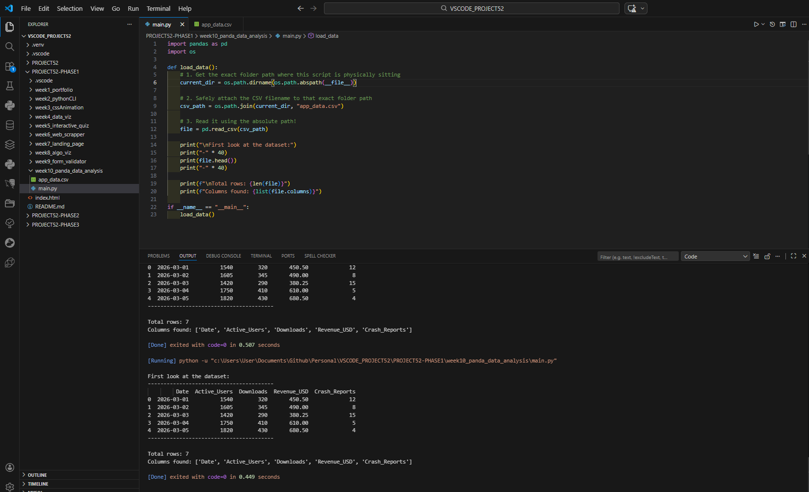

# 📝 DEV LOG: WEEK 10 - DAY 1

**Focus:** Initializing the Python Data Analysis environment, loading raw CSV data into a Pandas DataFrame, and bulletproofing the script against environment errors.

## 1. The Initiative
Week 10 shifts focus back to the backend. The goal is to build a Python CLI script capable of ingesting raw spreadsheet data (CSV) and outputting calculated statistics using the `pandas` library.

## 2. The Hurdles & Solutions

### Bug 1: `FileNotFoundError` (The Pathing Issue)
When running the script via VS Code's "Code Runner" extension, Python was executing from the root workspace folder rather than the specific Week 10 folder, causing it to miss the `app_data.csv` file.
* **The Fix:** Instead of relying on the terminal's Current Working Directory, I used Python's `os` module to dynamically build an absolute file path. 
    ```python
    current_dir = os.path.dirname(os.path.abspath(__file__))
    csv_path = os.path.join(current_dir, "app_data.csv")
    ```
    This guarantees the script always looks exactly where it is saved, making the code highly portable.

### Bug 2: `UnicodeEncodeError` (The Terminal Encoding Issue)
Windows terminals often default to an older encoding (`cp1252`) which crashes when encountering modern characters like emojis (📊).
* **The Fix:** I used the `sys` module to force the standard output terminal into modern `utf-8` encoding.
    ```python
    sys.stdout.reconfigure(encoding='utf-8')
    ```

## 3. The Output
The environment is fully stabilized. The script successfully reads the dummy CSV data and outputs a perfectly formatted Pandas DataFrame into the terminal.



---

