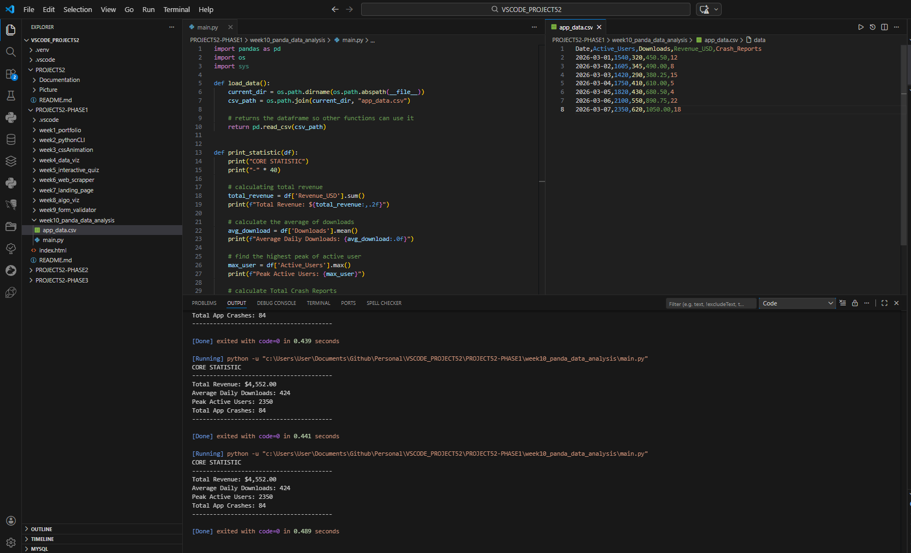

# 📝 DEV LOG: WEEK 10 - DAY 2

**Focus:** Extracting and calculating core statistics from a Pandas DataFrame using built-in mathematical methods.

## 1. The Initiative
Raw data is useless without analysis. Today's objective was to refactor the script to separate the data-loading logic from the math logic, and then calculate key business metrics (Total Revenue, Average Downloads, Peak Users, and Total Crashes) from the dataset.

## 2. The Concepts

### Concept A: Column Targeting
In Pandas, you don't need to iterate through rows to access data. You can target an entire column instantly using bracket notation, similar to accessing a key in a Python dictionary:
`df['Revenue_USD']`

### Concept B: Built-in Math Methods
Once a column (Series) is isolated, Pandas provides highly optimized, built-in methods to perform calculations across the entire dataset instantly:
* `.sum()`: Adds all values in the column together.
* `.mean()`: Calculates the average of the values.
* `.max()`: Finds the highest value in the column.

### Concept C: String Formatting
To make the raw numbers readable for human users, I utilized Python's f-string formatting options. For example, `total_revenue:,.2f` tells Python to insert commas for thousands and round the decimal to exactly two places, formatting it perfectly as currency.

## 3. The Output
The script now successfully isolates the DataFrame and prints a cleanly formatted "Core Statistics" dashboard to the terminal.

---
