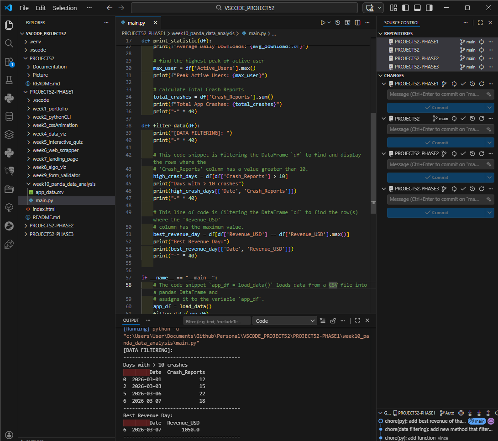

# 📝 DEV LOG: WEEK 10 - DAY 3

**Focus:** Utilizing boolean conditionals to filter rows and extract highly specific data points from the DataFrame.

## 1. The Initiative
Broad statistics provide an overview, but business intelligence requires granular insights. Today's goal was to build a new function capable of filtering out irrelevant rows based on conditional logic (e.g., finding specific high-crash days or pinpointing the maximum revenue day).

## 2. The Concepts

### Concept A: Function Modularity
To maintain clean architecture, I separated the operations into distinct functions. `load_data()` is strictly responsible for building the DataFrame and returning it. The returned DataFrame (`app_df`) is then passed into distinct analytical functions (`print_statistics` or `filter_data`), ensuring the logic remains decoupled and modular.

### Concept B: Boolean Filtering (The Bracket Notation)
In Pandas, filtering relies on evaluating a condition and wrapping it in brackets around the DataFrame:
`df[ df['Column'] > Value ]`

* **The Inner Bracket (`df['Crash_Reports'] > 10`):** Evaluates every row in the column against the condition, resulting in a temporary Series of `True` and `False` values.
* **The Outer Bracket (`df[ ... ]`):** Applies that True/False Series back to the main DataFrame, effectively deleting any row that registered as `False`.

### Concept C: Multi-Column Selection
Printing an entire filtered row can crowd the terminal. To isolate specific data points (like the Date and Revenue), I passed a list of column names into the bracket notation:
`print(best_revenue_day[['Date', 'Revenue_USD']])`
This ensures only the relevant subset of the DataFrame is rendered to the console.

## 3. The Output
The script now features a robust `filter_data()` function that accurately isolates and prints highly specific subsets of the main DataFrame based on conditional logic.

---
