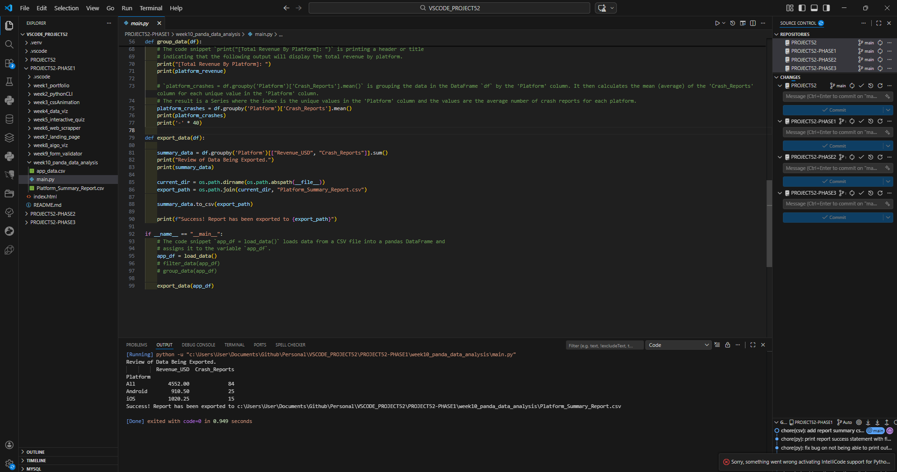

# 📝 DEV LOG: WEEK 10 - DAY 5

**Focus:** Automating the generation of external files by exporting processed Pandas DataFrames to new CSV reports.

## 1. The Initiative

Terminal output is excellent for debugging and development, but end-users and stakeholders require tangible files. The objective today was to take the grouped summary data and command Pandas to write it directly to the hard drive as a new `.csv` file.

## 2. The Concepts

### Concept A: DataFrame Exporting (`to_csv`)

Pandas is bidirectional. Just as `pd.read_csv()` ingests data, the `.to_csv()` method writes data. By chaining this method to the end of a processed DataFrame, Python handles all the formatting, comma-separation, and file generation automatically.

### Concept B: Absolute Path Generation (Write Mode)

To ensure the new report is generated in the correct project folder (rather than a random root directory), I reused the `os.path` logic from Day 1.

```python
export_path = os.path.join(current_dir, "platform_summary_report.csv")
```

Passing this absolute path into `.to_csv(export_path)` guarantees the file is saved precisely where the script resides, making the tool highly reliable across different environments.

## 3. The Output

The script now successfully processes raw app data, groups it by platform, and autonomously generates a `platform_summary_report.csv` file directly into the Week 10 workspace.



---
