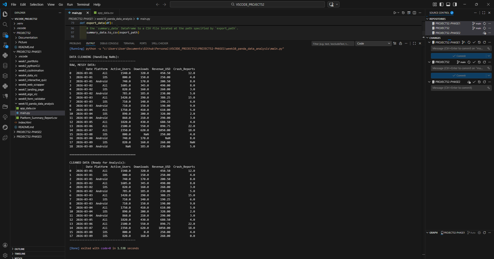

# 📝 DEV LOG: WEEK 10 - DAY 6 

**Focus:** Identifying and handling missing or corrupted data (`NaN` values) within a dataset to prevent calculation errors.

## 1. The Initiative
Real-world data is rarely pristine. Blank cells in CSVs are imported into Pandas as `NaN` (Not a Number), which can skew statistics or crash scripts. The objective today was to build a data pipeline that automatically detects `NaN` values and either patches them with defaults or purges the corrupted rows entirely.

## 2. The Concepts

### Concept A: Patching Data (`.fillna()`)
For non-critical columns where a blank implies a zero (like `Downloads` or `Crash_Reports`), I utilized `.fillna(0)`. This targets the specific column and replaces all `NaN` instances with a safe, calculable `0.0` value, preserving the rest of the row's data.

### Concept B: Purging Data (`.dropna()`)
For critical columns where missing data renders the entire row useless (like `Revenue_USD` or `Active_Users`), I utilized `.dropna(subset=[...])`. This method scans the specified subset of columns and outright deletes any row that contains a `NaN` in those fields, ensuring only high-quality data passes through to the analytical functions.

## 3. The Output
The `clean_data()` function successfully processed a corrupted dataset, patching minor blanks with zeros and dropping critically flawed rows, resulting in a perfectly sanitized DataFrame ready for mathematical analysis.

---
