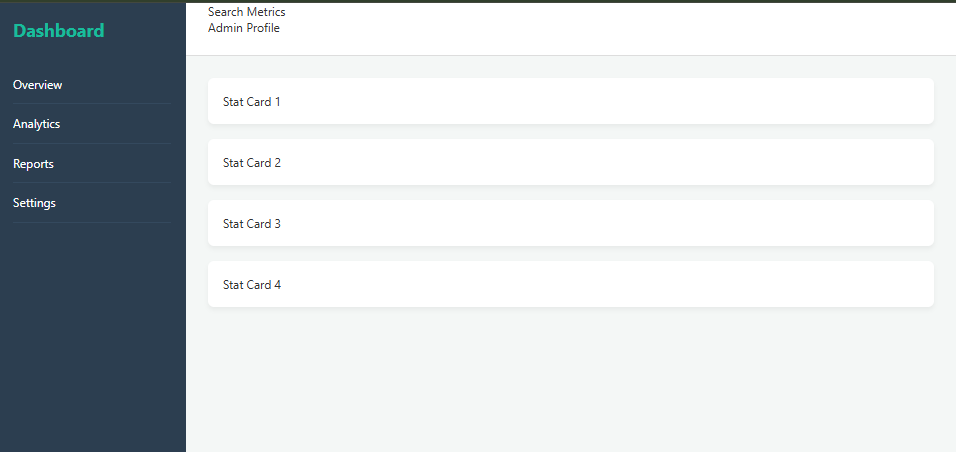

# 📝 DEV LOG: WEEK 11 - DAY 1

**Core Objective:** Establish a resilient, unbreakable 2D layout skeleton for a modern Admin Dashboard application utilizing CSS Grid architecture, entirely avoiding legacy positioning hacks like floats or fixed margins.

## 1. The Initiative & Context
Moving into Week 11 of PROJECT52, the focus transitions from back-end data engineering (Python/Pandas) back to front-end interface design. The objective is to build a responsive, professional-grade dashboard UI. Before worrying about typography, colors, or interactive elements, the critical first step is pouring the concrete foundation. A weak layout structure will inevitably break when populated with dynamic data or viewed on different screen sizes; therefore, CSS Grid was selected as the layout engine.

## 2. Architectural Decisions & Concepts

### Concept A: CSS Grid vs. Flexbox (The "Why")
Modern UI development relies heavily on two layout systems, each serving a distinct purpose:
* **Flexbox (1-Dimensional):** Ideal for aligning items along a single axis (either a row OR a column). It acts as the "organs" of the layout, perfect for spacing buttons inside a header or aligning icons next to text.
* **CSS Grid (2-Dimensional):** Designed for simultaneous layout across both rows AND columns. It acts as the "skeleton," making it the mathematically correct choice for macro-layouts like a full-screen dashboard where a sidebar, header, and main content area must coexist rigidly.

### Concept B: Defining the Grid Tracks
To carve up the viewport, I applied `display: grid;` to the master `.dashboard-container` and defined explicit tracks:
* `grid-template-columns: 250px 1fr;` -> This forces the first column (the sidebar) to remain exactly 250 pixels wide at all times, while the second column (the main content) dynamically consumes exactly `1fr` (one fraction), representing 100% of the remaining available screen space.
* `grid-template-rows: 70px 1fr;` -> This forces the top row (the header) to a static 70px height, allowing the content below it to stretch and fill the rest of the viewport.

### Concept C: Grid Template Areas (Semantic Mapping)
Instead of manually calculating complex grid-line numbers (e.g., `grid-column: 1 / 2;`), I utilized `grid-template-areas`. This allows for visual, semantic mapping directly in the CSS:
```css
grid-template-areas: 
    "sidebar header"
    "sidebar main";
````

By assigning `grid-area: sidebar;` to the HTML `<aside>` element, the browser automatically snaps the element into the corresponding named zone. This approach makes the CSS inherently self-documenting and drastically easier to maintain or restructure in the future.

## 3. Code Implementation & Breakdown

**The HTML Skeleton:**
A semantic HTML5 structure was used to outline the major regions:

- `<aside>`: For the navigation sidebar.
- `<header>`: For the top search bar and user profile zone.    
- `<main>`: For the primary data visualization cards.

**The CSS Foundation:**

``` CSS
.dashboard-container {
    display: grid;
    height: 100vh; /* Locks container to exactly 100% of the viewport height */
    grid-template-columns: 250px 1fr;
    grid-template-rows: 70px 1fr;
    grid-template-areas: 
        "sidebar header"
        "sidebar main";
}
```

## 4. The Output & Result

The dashboard skeleton is successfully scaffolded. The interface now features a fixed, dark-themed sidebar locked to the left, a light header spanning the top right, and a scrolling main content area. This provides a mathematically sound, robust container ready to house the Flexbox-driven metric cards in the upcoming sessions.




---
