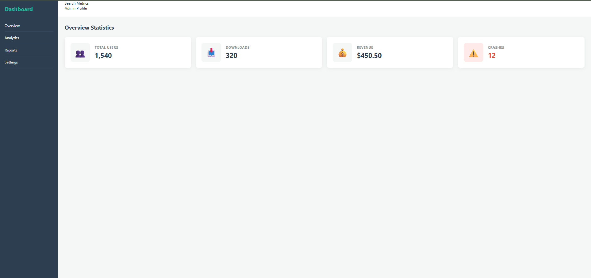

# 📝 DEV LOG: WEEK 11 - DAY 2

**Core Objective:** Implement 1-Dimensional (1D) Flexbox layouts within our established CSS Grid zones to horizontally align interactive component blocks (Stat Cards) and construct a professional, user-friendly interface.

## 1. The Initiative & Context
With the overarching 2D skeleton (Sidebar, Header, Main Content) rigidly defined by CSS Grid on Day 1, Day 2 focused on populating the `main-content` zone. The goal was to visualize the raw data metrics (calculated during Week 10's Python pipeline) into digestible, aesthetically pleasing UI components. To achieve this horizontal alignment flawlessly, CSS Flexbox was deployed as the internal layout engine.

## 2. Architectural Decisions & Concepts

### Concept A: Micro-Layouts with Flexbox
If CSS Grid is the building's structural frame, Flexbox is the interior design. Flexbox excels at taking a group of sibling elements and distributing them logically along a single axis (a row or a column). 
By applying `display: flex;` to the `.cards-wrapper` container, the block-level HTML `
` elements immediately abandoned their default top-to-bottom stacking behavior and snapped into a fluid horizontal row.

### Concept B: Mathematical Spacing (`gap`)
Historically, developers relied on complex `margin-right` calculations (and CSS pseudo-selectors like `:last-child`) to space elements. Flexbox modernizes this with the `gap` property.
* `gap: 20px;` was applied to the wrapper container. This injects exactly 20 pixels of negative space *between* the cards, without adding unnecessary outer margins that could break the layout.

### Concept C: The Power of `flex: 1`
To ensure a symmetrical UI, all cards must be identical in width, regardless of their internal text length (e.g., "Total Users" vs. "Crashes").
* Applying `flex: 1;` to the individual `.card` class instructs the browser: *"Count how many sibling elements exist in this container, and divide the available horizontal space equally among them."* This ensures uniform stretching and a perfectly balanced row.

### Concept D: Nested Flexbox Contexts
Flexbox is not limited to parent containers; it can be nested indefinitely. Inside each individual `.card`, another `display: flex;` context was established to align the emoji icon alongside the text data.
* `align-items: center;` was utilized to perfectly vertically center the icon relative to the text block, creating a polished, professional component structure.

## 3. Component Styling & Visual Feedback
To elevate the UI beyond a wireframe, modern styling techniques were applied:
* **Elevation:** `box-shadow` was used to lift the cards off the background, establishing a visual hierarchy.
* **Micro-interactions:** A CSS `transition` combined with a `:hover` pseudo-class (`transform: translateY(-5px);`) provides immediate kinetic feedback to the user, making the dashboard feel tactile and responsive.
* **Conditional/State Styling:** A specialized `.error-card` class was created for the "Crashes" metric, utilizing red hues (`#e74c3c` and `#ffeaea`) to draw the user's eye to critical system warnings based on color psychology.

## 4. The Output & Result
The dashboard's main content area is now populated with four perfectly aligned, responsive, and interactive statistic cards. The integration of Grid (macro-layout) and Flexbox (micro-layout) is functioning seamlessly.

---
