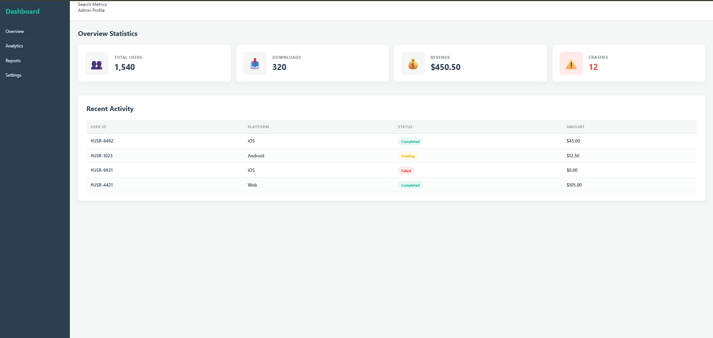

# 📝 DEV LOG: WEEK 11 - DAY 3

**Core Objective:** Design and implement a modern, highly readable Data Table to display granular recent activity, utilizing semantic HTML structure and advanced CSS pseudo-selectors to reduce cognitive load.

## 1. The Initiative & Context
While the top-level metric cards (built on Day 2) provide a macro-view of system health, administrative dashboards require micro-level data ledgers (e.g., recent transactions, user sign-ups). The objective today was to construct an HTML table. However, default HTML tables suffer from archaic, cluttered styling. The focus was heavily placed on UI/UX principles to transform raw data into a scannable, premium interface component.

## 2. Architectural Decisions & Concepts

### Concept A: Semantic Table Hierarchy
To ensure accessibility and proper styling hooks, the table was constructed using strict HTML5 semantics rather than relying on generic `
` tags:
* `<table>`: The primary wrapper.
* `<thead>`: Isolates the column titles, allowing for distinct header styling (uppercase, bold, subtle text).
* `<tbody>`: Contains the actual data iterations.
* `<tr>`, `<th>`, `<td>`: Defines the rows, header cells, and standard data cells respectively.

### Concept B: The CSS Table Reset
By default, browsers render tables with awkward gaps between every single cell. 
* Applying `border-collapse: collapse;` to the `.data-table` container strips away this legacy spacing, fusing the cells together and allowing for clean, modern, single-line bottom borders (`border-bottom: 1px solid #eee;`).

### Concept C: Zebra Striping for Scannability
When displaying dense rows of data, the human eye struggles to track horizontally across the screen. 
* I utilized the `:nth-child(even)` pseudo-selector (`.data-table tbody tr:nth-child(even)`). This programmatically applies a subtle `#fbfcfc` background color to every alternating row. This "zebra striping" drastically reduces cognitive load and improves horizontal tracking without requiring manual class assignments in the HTML.
* A `:hover` state was also added to the rows to provide immediate interactive feedback when the user's cursor tracks across a specific entry.

### Concept D: Color-Coded UI Badges
Standard text for statuses (like "Pending" or "Failed") blends in. To elevate the UX, I designed custom status badges.
* These elements utilize heavy `border-radius: 20px;` to create a pill shape.
* Color psychology was applied via distinct CSS classes: `.success` (Green), `.pending` (Yellow), and `.error` (Red). This allows the administrator to instantly identify problematic transactions at a mere glance.

## 3. The Output & Result
The dashboard now features a comprehensive "Recent Activity" ledger situated cleanly beneath the primary stat cards. The data is highly legible, interactive, and visually aligns with the modern aesthetic of the surrounding application.

---
