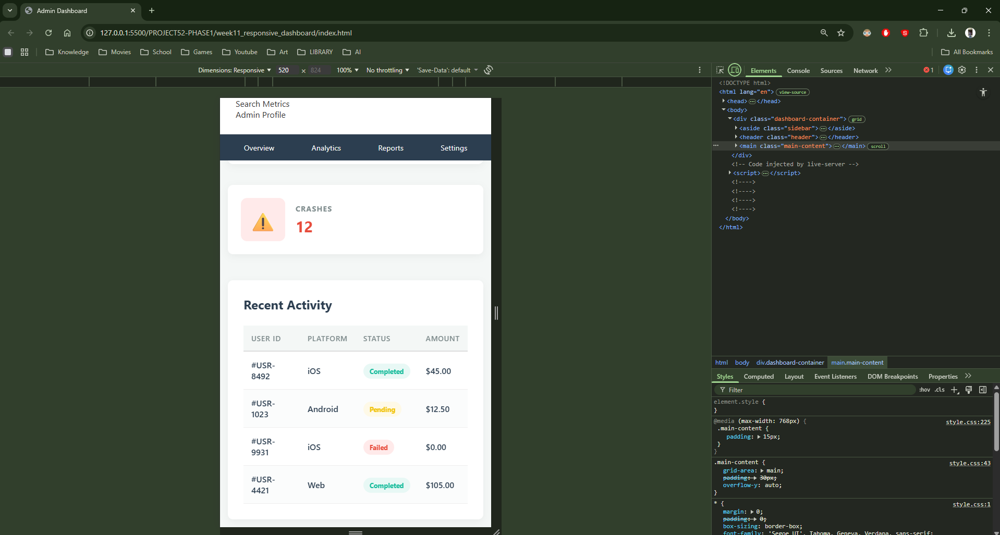

# 📝 DEV LOG: WEEK 11 - DAY 4

**Core Objective:** Implement CSS Media Queries to inject conditional logic into the stylesheet, allowing the dashboard's Grid and Flexbox architectures to dynamically shape-shift based on the user's viewport size (specifically targeting mobile devices).

## 1. The Initiative & Context
A static, desktop-only layout is a critical failure point for modern SaaS applications. If a user accesses the dashboard via a smartphone, the fixed 250px sidebar and horizontal Flexbox cards would cause severe UI overflow and render the data unreadable. The objective today was to build a "responsive breakpoint" using CSS `@media` rules to completely restructure the layout for screens smaller than 768 pixels.

## 2. Architectural Decisions & Concepts

### Concept A: The CSS Media Query
Media queries act as conditional `if` statements for the browser rendering engine. 
* By wrapping a block of CSS in `@media (max-width: 768px) { ... }`, I instructed the browser to listen to the viewport width. If the width drops below 768px (standard tablet/mobile breakpoint), the browser activates the enclosed CSS rules, overriding the default desktop styles.

### Concept B: Rebuilding the Grid Skeleton
The 2D CSS Grid structure defined on Day 1 was overridden for mobile:
* `grid-template-columns: 1fr;` forced the layout from two columns down to a single, full-width column.
* The `grid-template-areas` were updated to stack vertically: Header on top, Sidebar navigation in the middle, and Main Content on the bottom. 
* The sidebar's list items (`<li>`) were updated to `display: flex; justify-content: space-around;`, transforming the bulky vertical menu into a sleek, horizontal mobile navigation bar.

### Concept C: Flexbox Direction Shifting
The stat cards built on Day 2 relied on a horizontal Flexbox row. 
* By applying `flex-direction: column;` to the `.cards-wrapper` inside the media query, the primary axis of the Flexbox container was flipped 90 degrees. This forced the cards to stack vertically, providing a native scrolling experience for mobile users.

## 3. Debugging: The CSS Cascade
During implementation, a visual bug occurred where the mobile padding (`padding: 15px`) was being ignored by the browser, rendering with a strikethrough in the Chrome DevTools. 
* **The Root Cause:** CSS stands for *Cascading* Style Sheets. The browser reads rules from top to bottom; the last rule declared wins. The media query block was placed above the standard desktop rules, meaning the desktop rules were continuously overwriting the mobile overrides.
* **The Fix:** The entire `@media` block was moved to the absolute bottom of the `style.css` file, ensuring its conditional rules retain the highest priority when the viewport shrinks.

## 4. The Output & Result
The dashboard is now a fully responsive application. It presents a robust, data-dense interface on desktop monitors and seamlessly collapses into a streamlined, touch-friendly UI on mobile devices without altering the underlying HTML structure.

---