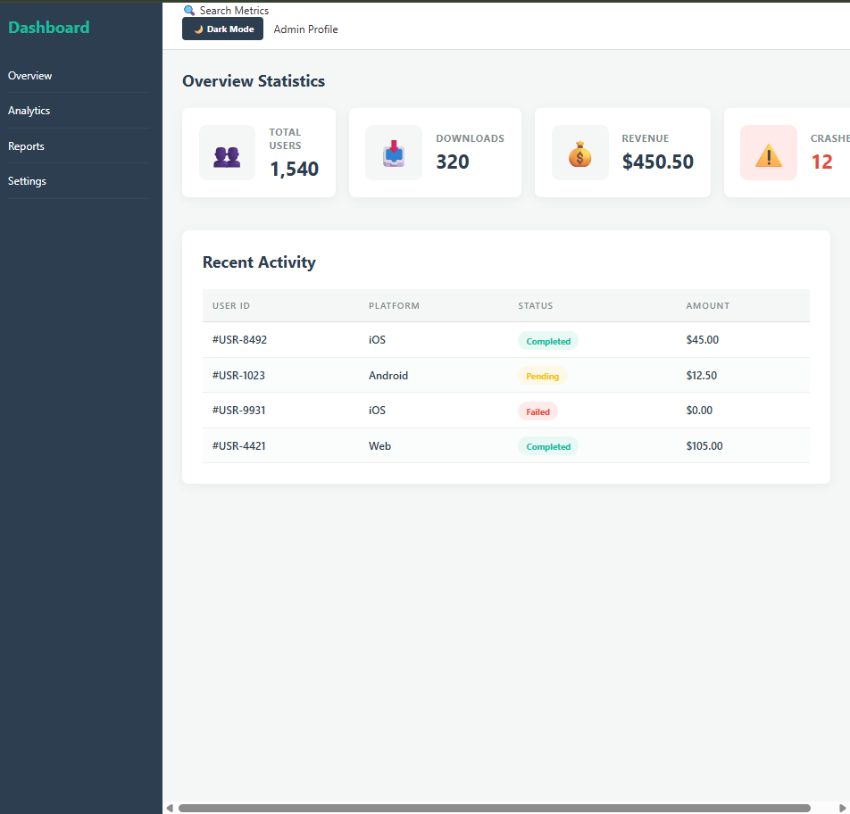
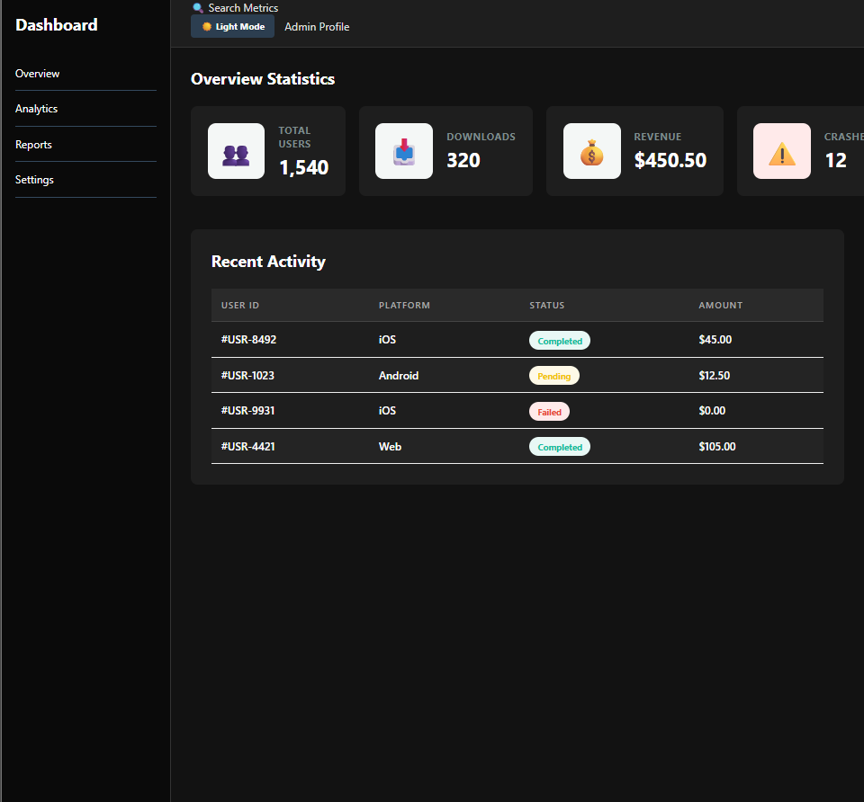

# 📝 DEV LOG: WEEK 11 - DAY 5

**Core Objective:** Implement a user-controlled "Dark Mode" theme toggle by bridging CSS state overrides with JavaScript DOM (Document Object Model) manipulation, providing a premium, accessible user experience.

## 1. The Initiative & Context
Modern web applications are expected to respect user viewing preferences, especially in data-heavy environments like admin dashboards where screen glare can cause eye strain. The objective today was to build a functional theme toggle. Instead of creating an entirely separate stylesheet, the architecture relies on applying a global "state" class to the root `<body>` element and cascading the dark variables downward.

## 2. Architectural Decisions & Concepts

### Concept A: CSS State Overrides
To execute a theme swap efficiently, I defined a new global state class: `.dark-theme`. 
* By attaching this class directly to the `<body>` tag, I can target any nested element using descendant selectors (e.g., `body.dark-theme .card`). 
* This approach allowed me to redefine the `background-color`, `border-color`, and `color` properties for the Header, Sidebar, Cards, and Data Table simultaneously, overriding the default light mode styles without altering the base layout mechanics.

### Concept B: JavaScript DOM Manipulation
CSS cannot listen for clicks on its own; it requires JavaScript to act as the interactive bridge.
* **Selection:** Utilized `document.getElementById('theme-toggle')` to target the button and `document.body` to target the root container.
* **Event Listening:** Attached an `addEventListener('click')` to the button to monitor for user input.
* **Class Toggling:** Executed `body.classList.toggle('dark-theme')`, which programmatically injects or removes the class from the DOM on every click.
* **Dynamic UI Updates:** Implemented conditional logic (`if/else`) to check if the `.dark-theme` class is currently active, dynamically updating the button's `textContent` ("🌙 Dark Mode" vs. "☀️ Light Mode") to reflect the system's current state.

### Concept C: Smooth State Transitions
An instantaneous color swap can be visually jarring and feel "cheap."
* To elevate the UX, I applied `transition: background-color 0.3s ease, color 0.3s ease;` globally to the `body`, `.card`, `.sidebar`, and `.data-table` elements. This forces the browser to mathematically calculate the intermediate colors, resulting in a buttery-smooth crossfade between the light and dark themes.

## 3. The Output & Result
The dashboard now boasts a fully functional, responsive, and state-aware Dark Mode. The integration of HTML structure, CSS styling, and JavaScript logic was perfectly executed, resulting in a production-ready interface.

---
