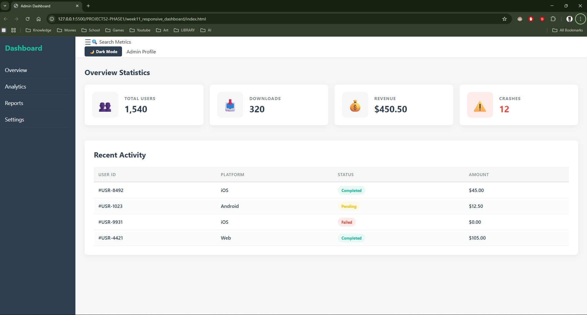
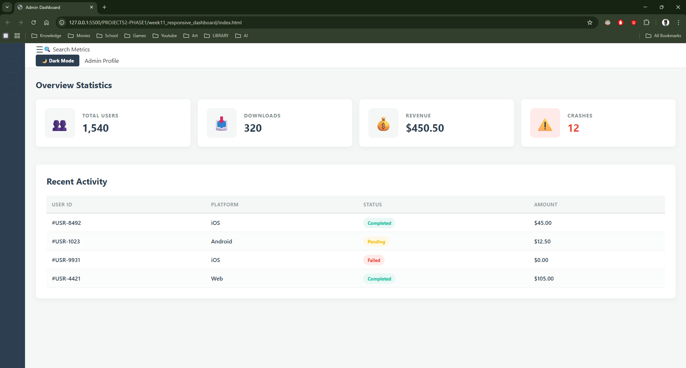

# 📝 DEV LOG: WEEK 11 - DAY 6 (OVERTIME)

**Core Objective:** Enhance the dashboard's user experience by engineering a collapsible sidebar navigation system, utilizing JavaScript state toggling and CSS Grid animations to maximize available screen real estate for data visualization.

## 1. The Initiative & Context
While the 250px fixed sidebar built on Day 1 provided excellent navigation structure, data-heavy admin dashboards often require maximum horizontal space for complex charts and wide tables. The objective for this "Overtime" session was to implement a toggle mechanism that allows the user to shrink the sidebar down to an icon-only view, dynamically shifting the primary layout without breaking the underlying architecture.

## 2. Architectural Decisions & Concepts

### Concept A: Dynamic CSS Grid Re-allocation
Instead of relying on absolute positioning or complex margin calculations to hide the sidebar, I manipulated the master CSS Grid directly.
* I defined a `.collapsed` state class on the `.dashboard-container`.
* When active, this class overrides the original `grid-template-columns: 250px 1fr;` to `grid-template-columns: 70px 1fr;`. 
* To prevent an instantaneous, jarring layout snap, I applied `transition: grid-template-columns 0.3s ease;` to the master container, forcing the browser to smoothly animate the physical layout of the grid tracks.

### Concept B: UI Space Management (Text vs. Icons)
Shrinking the column to 70px inherently causes text overflow issues.
* I restructured the HTML navigation to separate the icons from the text (wrapping the text in ``).
* In the CSS `.collapsed` state, I applied `display: none;` to the text spans and the main logo (`<h2>`), entirely removing them from the rendering engine. 
* I then updated the remaining list items to `justify-content: center;`, perfectly aligning the remaining navigation emojis in the center of the newly narrowed 70px column.

### Concept C: DOM Event Delegation
Similar to the Dark Mode implementation, JavaScript was required to act as the interactive trigger.
* I introduced a "Hamburger" menu button (`#sidebar-toggle`) into the header.
* Attached an event listener that executes `dashboard.classList.toggle('collapsed');` upon clicking, seamlessly bridging the user's intent with the CSS state engine.

## 3. The Output & Result
The dashboard now features a professional, animated collapsible sidebar. The integration ensures that users can toggle between a full navigation menu and a focused, data-first view instantly, further cementing the application as a highly polished, interactive piece of software.

---
