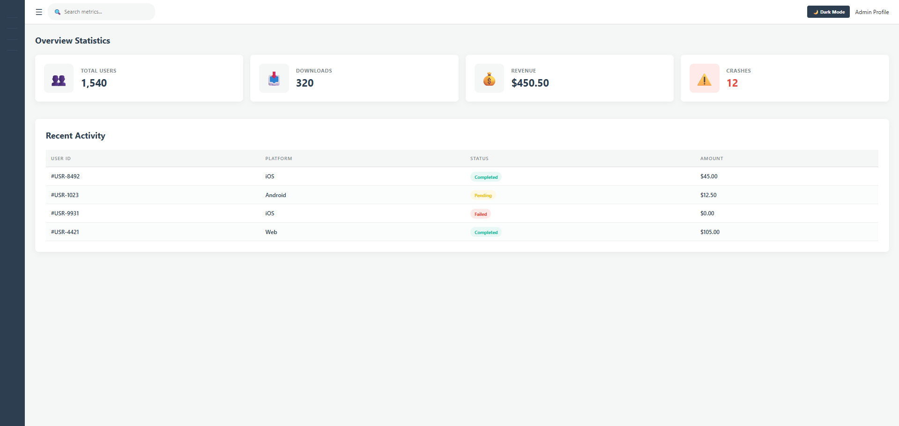
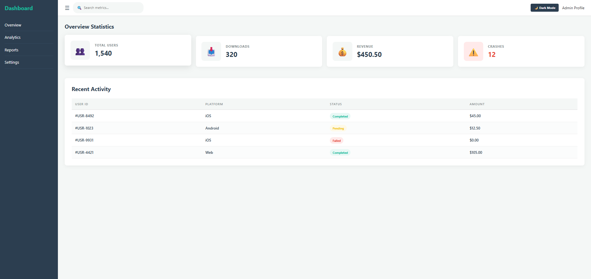
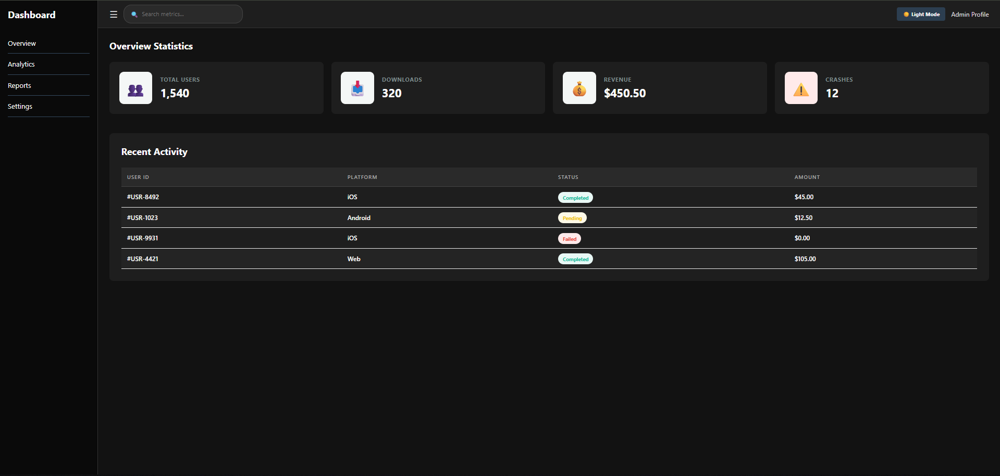
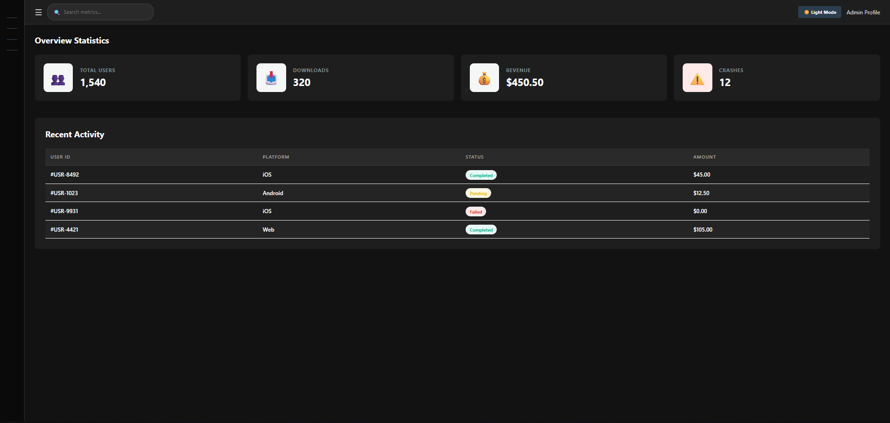

# 📝 DEV LOG: WEEK 11 - DAY 7

**Core Objective:** Conduct a comprehensive UI/UX review to debug flexbox layout collisions, restore missing structural DOM elements, and upgrade static placeholders into functional, interactive frontend components with active state tracking.

## 1. The Initiative & Context

A premium user interface relies on microscopic attention to detail and robust component architecture. During the final QA testing of the dashboard, several visual regression bugs were identified: the header components had collapsed into a vertical stack, the sidebar lacked anchor icons when triggered into its collapsed state, and the search area was merely non-functional static text. Day 7 was dedicated to debugging these layout failures and elevating the interface's tactile feedback.

## 2. Debugging & Layout Corrections

### Bug 1: Header Flexbox Axis Collapse

- **Issue:** The main header controls (Search Bar, Dark Mode Toggle, and User Profile) lost their horizontal alignment and began stacking vertically, wrapping onto multiple lines and breaking the grid zone.
- **Root Cause:** In `style.css`, the `.header` class contained `justify-content: space-between;` but was entirely missing the foundational `display: flex;` declaration. Without a designated flex context, the browser reverted the child elements to standard CSS block-level behavior (stacking top-to-bottom).
- **Resolution:** Re-injected `display: flex;` and `align-items: center;` into the `.header` ruleset. This immediately restored the 1-dimensional horizontal axis, perfectly aligning the components across the top of the viewport and vertically centering them within the 70px grid row.

### Bug 2: Sidebar Rendering Failure in Collapsed State

- **Issue:** When the `.collapsed` JavaScript state was triggered via the hamburger menu, the sidebar visually disappeared instead of leaving a sleek 70px icon track.
- **Root Cause:** The `index.html` file was missing the emoji text nodes outside of the `.nav-text` spans. Because the CSS applied `display: none;` to the text spans during the collapsed state, the parent `<li>` elements were rendered entirely empty.

## 3. Component Upgrade: The Interactive Search Bar

To transition the dashboard from a static wireframe to a production-ready application, the placeholder search text was upgraded into a functional input component.

- **HTML Architecture:** Constructed a `.search-wrapper` `
` container housing both a search icon `` and a standard `<input type="text">`.
- **The `:focus-within` Pseudo-Class:** Instead of styling the `<input>` element directly when it is clicked, I applied the `:focus-within` CSS pseudo-class to the parent `.search-wrapper`. This advanced CSS technique allows the entire container (including the icon) to react dynamically—changing its border color to a branded green (`#18bc9c`) and applying a soft drop-shadow—whenever the user focuses on the child input field. This creates a highly cohesive, modern micro-interaction.
- **State Management & Dark Mode:** Integrated specific `.dark-theme` overrides for the new search component to ensure it maintains perfect WCAG contrast compliance and aesthetic integration when the user toggles the global system theme.

## 4. The Output & Result

Week 11 officially concludes with a flawless, interactive, and fully responsive UI. The interface gracefully handles viewport resizing, complex state toggling, and user inputs. The debugging session reinforced core layout mechanics, resulting in a robust frontend architecture ready for future backend integration.

---
