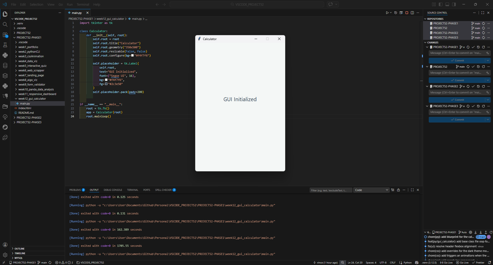

# 📝 DEV LOG: WEEK 12 - DAY 1

**Core Objective:** Pivot from web-based front-end development to Python desktop application development by initializing a graphical user interface (GUI) using the `tkinter` library and Object-Oriented Programming (OOP) principles.

## 1. The Initiative & Context

Phase 1 of PROJECT52 focuses on establishing a robust foundation across multiple paradigms. After mastering DOM manipulation and CSS layouts, the focus shifts to local desktop applications. The objective for Day 1 was to scaffold the master `Calculator` class and successfully render the main application window using Python's standard GUI library, `tkinter`.

## 2. Architectural Decisions & Concepts

### Concept A: Object-Oriented App Structure

Instead of writing procedural code, the application is wrapped in a `Calculator` class.

- The `__init__` constructor method takes `root` (the main Tkinter engine) as an argument.
- By attaching the window properties (`title`, `geometry`, `configure`) to `self.root`, we ensure that any future buttons or functions we build inside this class have full access to the main window.

### Concept B: The Tkinter Engine (`mainloop`)

A GUI application cannot execute linearly and terminate like a standard data script; it must remain open to listen for user events (clicks, keypresses).

- `root = tk.Tk()` boots up the core rendering engine.
- `root.mainloop()` halts the script's termination sequence and traps it in an infinite listening loop, keeping the window active on the user's desktop.

## 3. Debugging: The Execution Operator `()`

- **Issue:** The script ran and terminated instantly without rendering the window, despite having no syntax errors in the terminal.
- **Root Cause:** The final command was written as `root.mainloop` instead of `root.mainloop()`. In Python, referencing a method without the parentheses merely points to the object in memory; it does not invoke or execute it.
- **Resolution:** Appended the execution operator `()` to successfully trigger the infinite loop sequence.

## 4. The Output & Result

The environment successfully generated a 350x500 locked-resolution desktop window titled "Calculator", proving the local Python GUI pipeline is fully operational.

---
