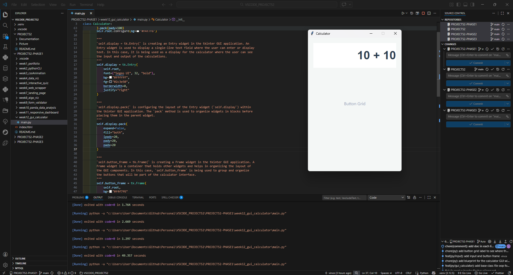

# 📝 DEV LOG: WEEK 12 - DAY 2

**Core Objective:** Construct the primary visual components of the local calculator interface—specifically the interactive digital display screen and the foundational grid container—utilizing Tkinter's `.pack()` geometry manager and custom styling parameters to maintain a modern, flat-design aesthetic.

## 1. The Initiative & Context

With the main application window successfully initialized and locked to a 350x500 resolution, the next phase of the UI build requires establishing the core structural skeleton. A standard calculator conceptually requires two distinct zones:

1. **The I/O Zone:** A top display area for numerical input and mathematical output.
2. **The Control Zone:** A bottom keypad area for user interaction.

The objective today was to instantiate these zones using specific Tkinter widgets (`tk.Entry` and `tk.Frame`) and logically stack them into the master application window.

## 2. Architectural Decisions & Component Breakdown

### Component A: The Display Screen (`tk.Entry`)

To handle both displaying the final results and capturing active keyboard inputs natively, I utilized the `tk.Entry` widget (Tkinter's equivalent of an HTML `<input type="text">`) rather than a static text label.

- **Styling Overrides:** Bypassed default OS desktop styling by injecting custom arguments. I used `font=("Segoe UI", 32, "bold")` to generate massive, highly readable numbers, `bg="#ffffff"` for high contrast against the app background, and `borderwidth=0` to enforce a sleek, borderless UI.
- **Text Alignment:** Applied `justify="right"`. Standard text boxes align left, but physical calculators push digits from the right. This argument perfectly mimics native hardware behavior.

### Component B: The Button Grid Skeleton (`tk.Frame`)

Complex UI layouts often require nested containers to prevent geometry collisions.

- I initialized a `tk.Frame` object (`self.button_frame`). This acts as an invisible, structural bounding box (similar to a CSS `
` wrapper).
- This frame isolates the bottom half of the application. By boxing this area off now, it securely prepares the environment for a localized spreadsheet layout (`.grid()`) tomorrow, allowing the buttons to be perfectly aligned without accidentally distorting the top display screen.

### Concept C: The `.pack()` Geometry Manager

Tkinter relies on Geometry Managers to physically map and render widgets to the active window. For this macro-layout, I utilized `.pack()`, which stacks elements sequentially.

- **Spatial Distribution:** Applied `fill="both"` to force the elements to stretch horizontally to the window's edges.
- **Padding Mechanics:** Utilized outer padding (`padx=20`, `pady=20`) to push the elements away from the window borders, and internal padding (`ipady=20`) inside the display screen to give the text vertical breathing room, heavily reducing cognitive load.

## 3. The Output & Result

The application now features a fully stylized, interactive numerical display (capable of natively accepting keystrokes) securely anchored to the top of the GUI. Beneath it, an invisible, structurally sound frame is locked into position, perfectly preparing the architecture for the procedural of the button matrix.

---
