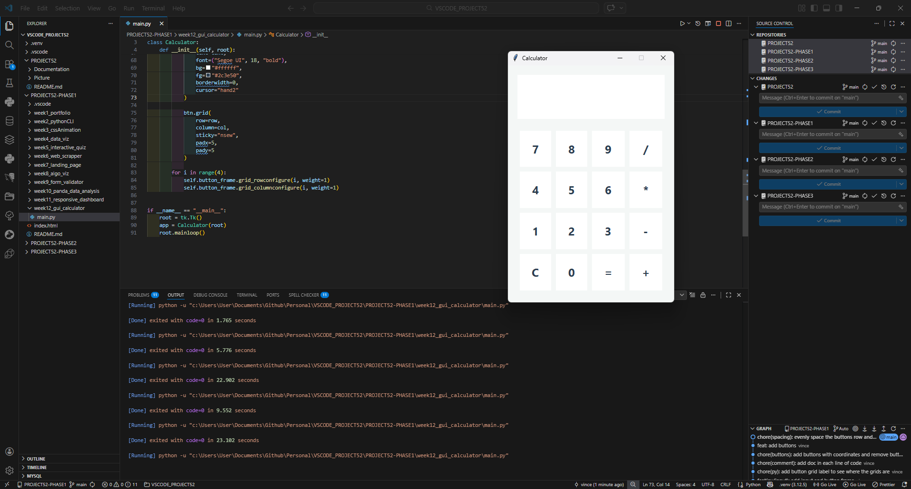

# 📝 DEV LOG: WEEK 12 - DAY 3

**Core Objective:** Replace the structural placeholder frame with a fully functional, mathematically accurate 4x4 grid of clickable UI buttons, utilizing programmatic generation (`for` loops) and Tkinter's `.grid()` geometry manager.

## 1. The Initiative & Context
With the main display and structural frame established, the application required its primary input mechanism: the keypad. Standard calculators utilize a precise matrix layout. Instead of manually instantiating 16 independent `tk.Button` objects (which violates the DRY - Don't Repeat Yourself principle), the objective was to engineer a data-driven approach to generate the UI dynamically.

## 2. Architectural Decisions & Concepts

### Concept A: Data-Driven UI (Tuple Matrix)
I separated the "data" from the "interface" by defining a list of tuples named `buttons`.
* Each tuple contains the exact blueprint for a specific button: `(Text, Row Index, Column Index)`.
* For example, `('7', 0, 0)` instructs the engine to place the number 7 at the absolute top-left of the coordinate plane.

### Concept B: Programmatic Generation (`for` loop)
By iterating over the `buttons` list, a single block of code handles the instantiation of the entire keypad.
* During each loop iteration, a `tk.Button` is generated, adopting standard AdaVizion styling (`bg="#ffffff"`, `borderwidth=0`, `font=("Segoe UI", 18, "bold")`).
* Added `cursor="hand2"` to provide immediate tactile visual feedback, transforming the user's cursor when hovering over an interactive element.

### Concept C: The `.grid()` Manager & Spatial Weights
To perfectly align the matrix inside the `tk.Frame`, I shifted from `.pack()` to `.grid()`.
* **Sticky Positioning:** Applied `sticky="nsew"` (North, South, East, West) to every button. This commands the button to stretch in all four directions, completely filling its assigned grid cell.
* **Grid Weights (`rowconfigure` / `columnconfigure`):** Executed a secondary loop `for i in range(4):` to apply `weight=1` to all four rows and columns. This mathematically commands the Tkinter rendering engine to take any excess spatial volume inside the frame and distribute it equally among the cells, guaranteeing a perfectly uniform layout regardless of the window's dimensions.

## 3. The Output & Result
The application now boasts a pristine, fully populated 4x4 keypad. The programmatic approach ensured rapid deployment, zero layout collisions, and a highly scalable architecture that can easily be expanded in the future.

---

