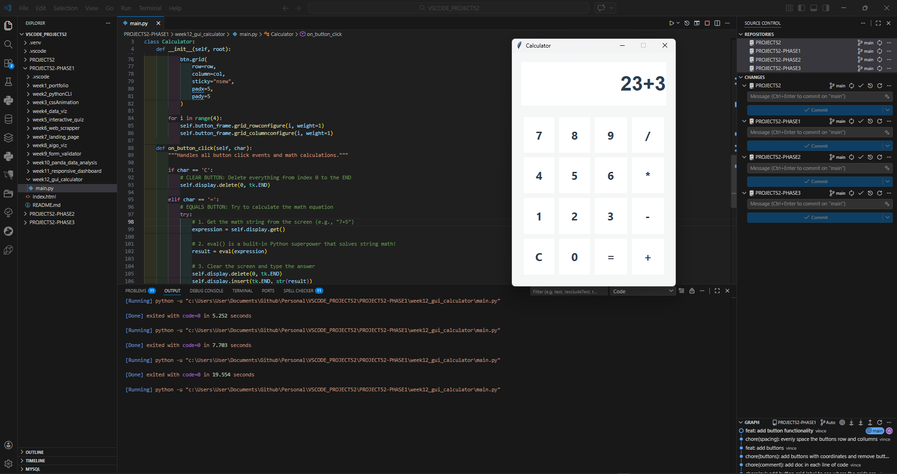

# 📝 DEV LOG: WEEK 12 - DAY 4

**Core Objective:** Wire the static frontend UI components to the Python backend by implementing event listeners, enabling the application to capture user keystrokes, process mathematical expressions, and dynamically update the digital display.

## 1. The Initiative & Context

With the visual matrix fully rendered, the application required an event-driven logic layer. The objective was to bind each generated `tk.Button` to a master controller method (`on_button_click`), allowing the UI to pass specific string characters to the backend for evaluation and screen manipulation.

## 2. Architectural Decisions & Concepts

### Concept A: Event Binding with Lambda Functions

Binding commands inside a programmatic `for` loop introduces a unique scope challenge.

- **The Problem:** If assigned directly (e.g., `command=self.on_button_click(text)`), Python evaluates the function immediately during UI generation, effectively "clicking" every button on boot and never again.
- **The Solution:** I utilized anonymous `lambda` functions: `command=lambda t=text: self.on_button_click(t)`. This "freezes" the execution, instructing the Tkinter engine to hold the specific character (`t`) in memory and only fire the method when a physical mouse-click event is detected.

### Concept B: The Logic Controller (`on_button_click`)

I engineered a master routing method to handle all incoming UI signals, utilizing conditional routing (`if/elif/else`):

- **Standard Input:** By default, it appends the clicked character to the end of the `tk.Entry` display using `self.display.insert(tk.END, char)`.
- **The Clear Function ('C'):** Triggers `self.display.delete(0, tk.END)`, wiping the array from index zero to the absolute end, resetting the board.

### Concept C: Mathematical Evaluation (`eval`) & Error Handling

To process the final mathematical string (e.g., "23+3"):

- **The Engine:** I utilized Python's built-in `eval()` function, which parses and solves valid mathematical strings natively, bypassing the need to write complex custom parsing algorithms for basic arithmetic.
- **Try/Except Block:** Because user input is inherently unpredictable (e.g., attempting to divide by zero, or inputting consecutive operators like "5++"), I wrapped the `eval()` execution in a `try/except` block. If an illegal mathematical operation is attempted, the engine catches the exception and cleanly outputs "Error" to the screen instead of crashing the local application.

## 3. The Output & Result

The application is now a fully functional calculator. The frontend and backend are successfully communicating, capturing clicks, processing advanced string mathematics, and gracefully handling user-generated errors.

---
