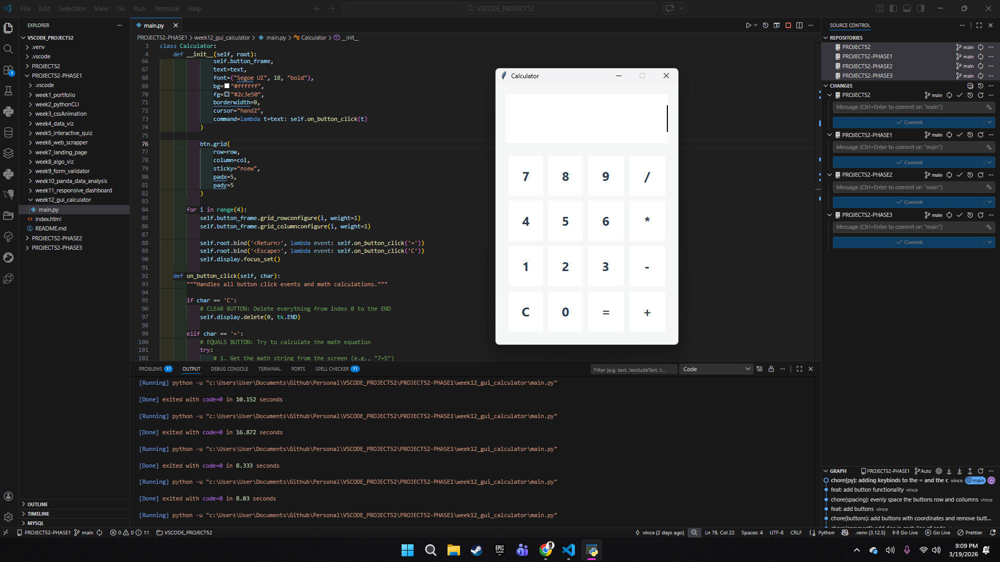
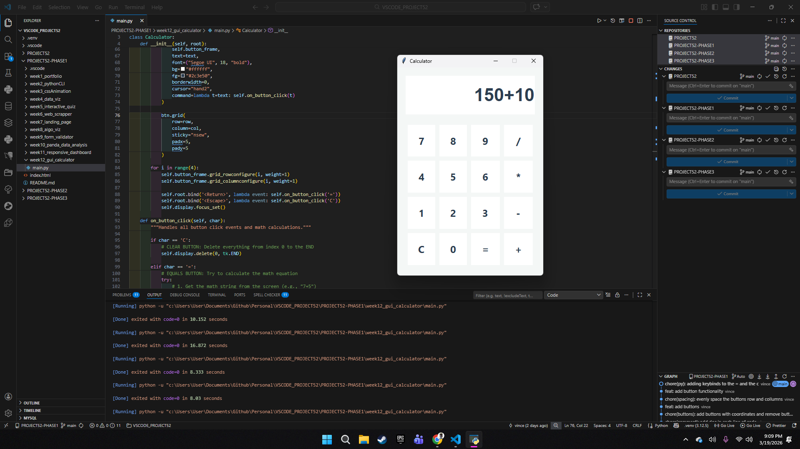
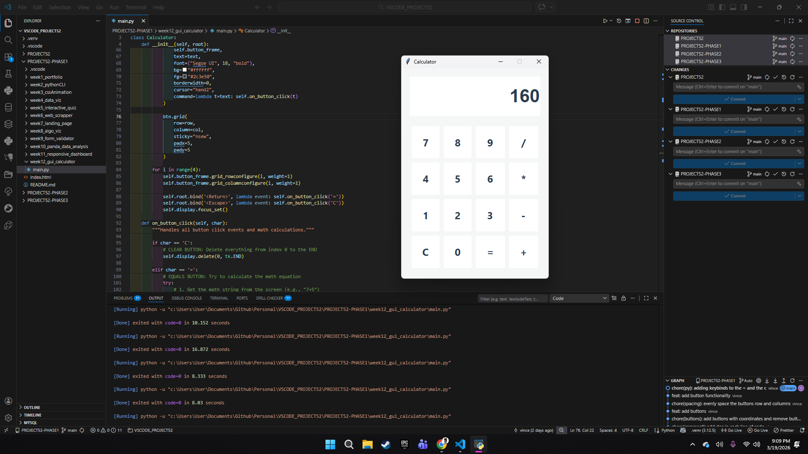

# 📝 DEV LOG: WEEK 12 - DAY 5

**Core Objective:** Finalize the application's User Experience (UX) by implementing hardware event listeners, allowing seamless integration between the physical keyboard and the graphical interface.

## 1. The Initiative & Context
While the mouse-driven UI was fully operational, relying strictly on mouse clicks for numerical entry creates high friction for desktop users. Because the `tk.Entry` widget naturally accepts keyboard strings, the missing link was execution. The user could type an equation, but pressing the physical "Enter" key yielded no result. Day 5 focused on bridging this hardware-to-software gap.

## 2. Architectural Decisions & Concepts

### Concept A: Mainloop Event Binding (`.bind()`)
To capture hardware keystrokes, I attached event listeners directly to the master window (`self.root`).
* **Execution Mapping:** Utilized `self.root.bind('<Return>', lambda event: self.on_button_click('='))`. This commands the Tkinter `mainloop` to monitor the user's keyboard. The moment the Enter (`<Return>`) key is struck, it triggers the exact same logic path as physically clicking the virtual `=` button.
* **Reset Mapping:** Mapped the `<Escape>` key to the `'C'` logic path, allowing the user to rapidly clear the board without utilizing the mouse.

### Concept B: Interface Focus (`focus_set`)
To eliminate the final point of friction, I applied `self.display.focus_set()` at the end of the initialization sequence.
* When the application boots, it now automatically forces the operating system's active cursor into the `tk.Entry` field. The user can open the app and immediately begin typing numbers without having to click inside the screen first.

## 3. The Output & Result
The Python GUI Calculator is officially production-ready. The application features a programmatic UI, robust string-math parsing, error handling, and complete hardware keyboard integration. Phase 1 of the development journey is successfully concluded.

---

