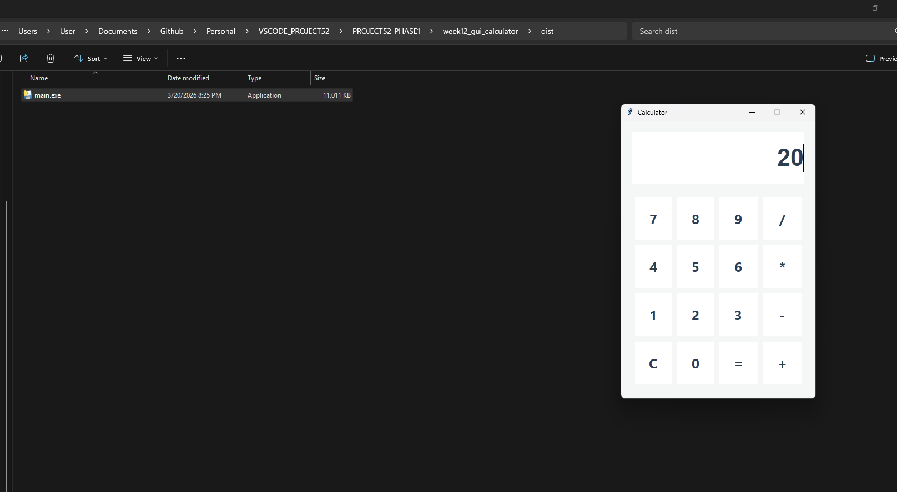

# 📝 DEV LOG: WEEK 12 - DAY 6 (OVERTIME)

**Core Objective:** Transition the Python GUI application from a local development script into a standalone, distributable Windows executable (`.exe`) utilizing the PyInstaller compilation library.

## 1. The Initiative & Context
While the calculator application was fully functional within the IDE, requiring a Python runtime environment and command-line execution creates an absolute barrier for standard end-users. The objective for this overtime session was to package the source code, the Tkinter UI library, and the Python interpreter into a single, native desktop application file.

## 2. Architectural Decisions & Concepts

### Concept A: The PyInstaller Compiler
I utilized `PyInstaller`, a robust packaging library that analyzes Python scripts, discovers all hidden imports and dependencies (like Tkinter), and bundles them together.

### Concept B: Compilation Flags
To ensure a premium software experience, I executed the build using specific command-line arguments:
* `--onefile`: Instructed the compiler to crush the entire environment and all dependencies into a single, portable `main.exe` file, rather than generating a messy directory structure.
* `--noconsole`: Suppressed the standard command prompt background window. When the user double-clicks the application, only the graphical user interface boots, perfectly mirroring standard native Windows software behavior.

## 3. The Output & Result
The compilation was a complete success. The application was exported to the local `dist` directory as a fully functional, self-contained executable. It runs natively on the host operating system entirely independent of VS Code or an explicit Python installation.

---
