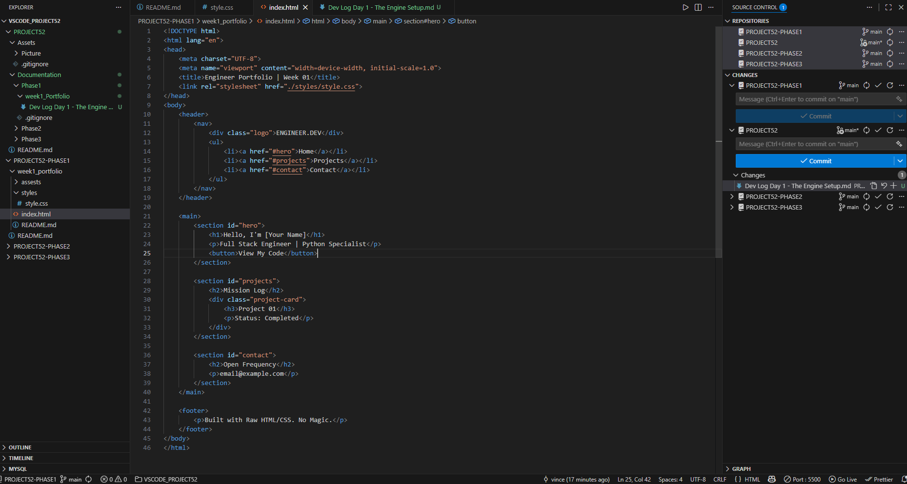

## 1. The Initiative

I have officially initiated **Project 52**. My objective is to transition from a pure Python/Game Development 
background (Pygame/OpenGL) to Full-Stack Engineering.

The constraint for Week 01 is strict: **No Frameworks.** No React, No Tailwind. I am forcing myself to understand the "metal" of the browser before abstracting it away. If I can build a 3D engine from scratch, I can build a DOM tree.

## 2. Environment Configuration
I established the standard project directory, mirroring a game engine's asset structure.

### 2.1 Directory Map
I chose a flat architecture to minimize complexity for the MVP.

```text
/root
├── index.html        # The Scene Graph (Entry Point)
├── styles/
│   └── style.css     # The Renderer (Visuals)
└── assets/           # Texture Storage
    └── images/
````

*Correction Note:* I initially misspelled the asset directory as `assests`, which caused a linkage error in the renderer. I have corrected this to `assets` to match standard conventions.

## 3. The Architecture: HTML as a Scene Graph

I had a breakthrough in mental modeling today: The DOM is just a Scene Graph.
In my Python 3D engine, I would structure a scene like this:

> `World` -> `Level` -> `Player` -> `HUD`

In HTML, I am doing the exact same thing using **Semantic Tags**:

> `<body>` -> `<main>` -> `<section>` -> `<header>`

I deliberately avoided using generic `<div>` tags for the top-level hierarchy. Using `<section>` and `<header>` provides semantic meaning to the "Game Objects," which will help with Accessibility and SEO later—much like how naming a class `Enemy` is better than naming it `Object_01`.

**Current Implementation:**

``` HTML 
<main>
    <section id="hero">...</section>
    <section id="projects">...</section>
</main>
```

## 4. Friction Point: The Runtime execution

I encountered a logic error in how I attempted to execute the code.

- **The Error:** I attempted to "Run" the HTML file via the VS Code terminal runner, resulting in a "Code language not supported" error.
    
- **The Diagnosis:** HTML is not a script; it is a document (an asset) that requires a specific runtime environment (The Browser) to parse it.
    
- **The Fix:** I installed the **Live Server** extension. This spins up a local web server on `127.0.0.1:5500`, effectively mimicking a production deployment. This allows for hot-reloading (the page refreshes when I save), significantly speeding up the feedback loop.

## 5. Visual Proof

The Skeleton (Greyboxing):
The raw geometry of the site before textures (CSS) are applied.

**The Workbench (Code Structure):**  **The Output (Browser Render):** 
