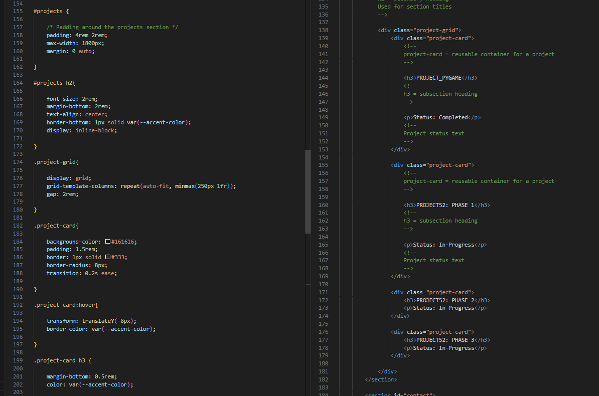
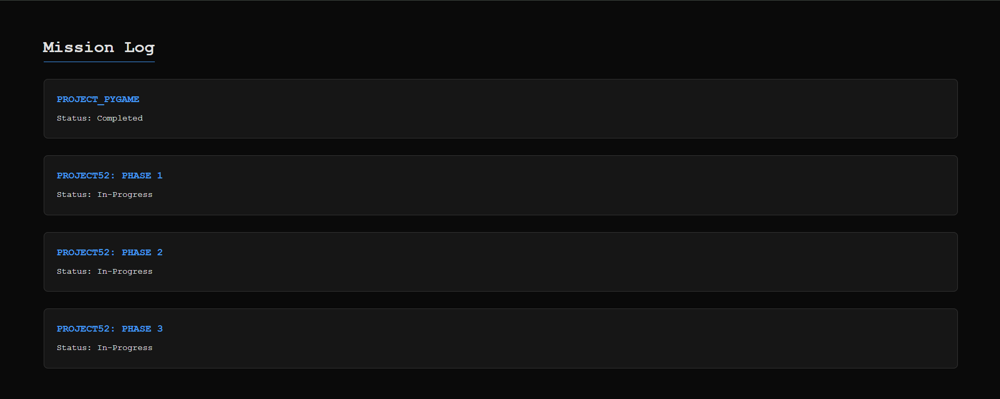

## 1. The Initiative

Today, I moved the project from the "Greyboxing" phase (Structure) to **Texture Mapping** (Visuals). The goal was to write a custom renderer from scratch without relying on frameworks like Bootstrap or Tailwind.

I established a "Terminal Dark Mode" aesthetic to reflect a raw engineering environment, using high-contrast neon accents against a dark grey background.

## 2. Global Systems (The Engine Config)

Before building specific levels, I had to configure the global rendering rules.

### 2.1 The Reset & Variables
I learned that browsers have inconsistent default styles (margins/padding). I implemented a global reset to ensure "Physics Consistency" across all elements.

I also defined **CSS Variables** (`:root`), which act as my global constants—similar to defining `PLAYER_COLOR = (0, 255, 0)` in Pygame. This allows me to change the entire theme by modifying just four lines of code.

```css
:root {
    --bg-color: #0a0a0a;      /* The Void */
    --accent-color: #00ff41;  /* Terminal Green */
    --font-main: 'Courier New', monospace;
}
````

## 3. The Layout Engines: Flexbox vs. Grid

I implemented two distinct layout algorithms today. Understanding when to use which was the core technical challenge.

### 3.1 Flexbox (The 1D Engine)

I used **Flexbox** for the Navigation Bar and Hero Section.

- **Logic:** These elements exist on a single axis (Row or Column).
- **Implementation:** `justify-content: space-between` allowed me to anchor the Logo to `x=0` and the Links to `x=Width` instantly.

### 3.2 CSS Grid (The 2D Engine / Tilemap)

I used **CSS Grid** for the Projects Section.

- **Logic:** I needed a system that manages both Rows and Columns simultaneously, exactly like a **Tilemap** in a 2D game.
- **The Algorithm:** I used a specific function to create a "Responsive Tilemap" that automatically calculates how many cards fit on the screen without using media queries.    

**The Magic Spell:**

``` CSS
.project-grid {
    display: grid;
    /* Create columns that repeat. Fit as many as possible (auto-fit). */
    /* Each column is at least 250px wide. */
    grid-template-columns: repeat(auto-fit, minmax(250px, 1fr));
}
```

## 4. Friction Point: The Documentation Pipeline

I encountered friction not in the code, but in the **Documentation Workflow**.

- **The Error:** I struggled to link screenshots correctly because my Obsidian vault structure is separated from my Code Repository structure.

- **The Diagnosis:** Relative paths (`../../`) get complicated when assets are deep in a different folder tree.

- **The Fix:** I learned to use **Semantic Naming** for my assets (`grid_system.png` instead of `image_45a.png`) and verified the relative path distance between my Markdown file and the Asset folder.    

## 5. Visual Proof


The Project Cards automatically stacking based on available screen width.


The final render with Dark Mode and Hover effects active.

