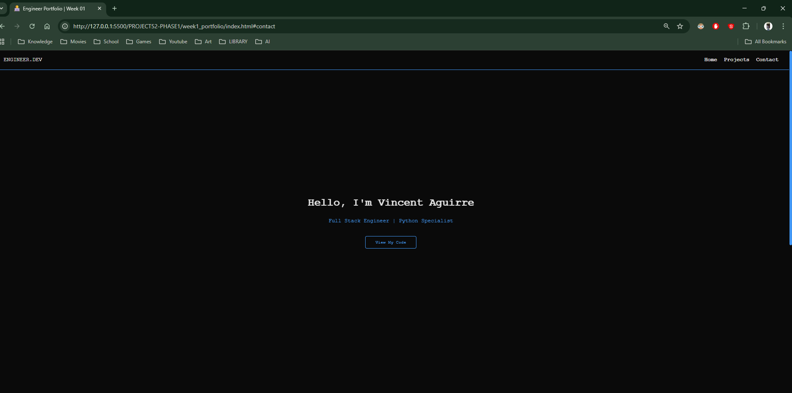

## 1. The Polish ("The Juice")
Today I focused on **Game Feel**—making the static page feel alive.
* **Smooth Scrolling:** Implemented `scroll-behavior: smooth` to simulate a camera pan instead of a teleport when navigating links.
* **Entrance Animations:** Created a generic `@keyframes slideUp` animation. I applied this to the Hero text with staggered `animation-delay` (0s, 0.2s, 0.4s) to create a cascading entrance effect.
* **Custom Scrollbar:** Overrode the default browser scrollbar using `::-webkit-scrollbar` to match the site's Dark Mode palette.

## 2. Responsive Logic (The Resize Event)
I implemented a **Mobile-First** safety net using Media Queries.

```css
@media (max-width: 768px) {
    nav { flex-direction: column; }
}
````

This acts as a conditional logic gate: `if (screen.width < 768) { switch_layout_mode(); }`. It ensures the Navigation bar stacks vertically on phones instead of crushing horizontally.

## 3. Technical Analysis (Post-Mortem)

Reviewing the week's code, I solidified my understanding of the **Rendering Pipeline**:

### 3.1 The DOM as a Scene Graph

I structured my HTML (`index.html`) as a strict hierarchy. The `<body>` acts as the Root Node, containing specific Game Objects (`<header>`, `<main>`, `<footer>`). This semantic structure allows styles to "cascade" (inherit) down from parent to child, reducing code duplication.

### 3.2 The Layout Systems

I successfully integrated two different layout engines:

- **Flexbox** for linear components (Navbar).
    
- CSS Grid for matrix components (Project Gallery).
    
    Using repeat(auto-fit, minmax(...)) in Grid proved to be a powerful algorithm for handling responsiveness without explicit breakpoints.
    

## 4. Visual Proof

**Mobile View (Stacked Nav):** 

**The Custom Scrollbar:** 


