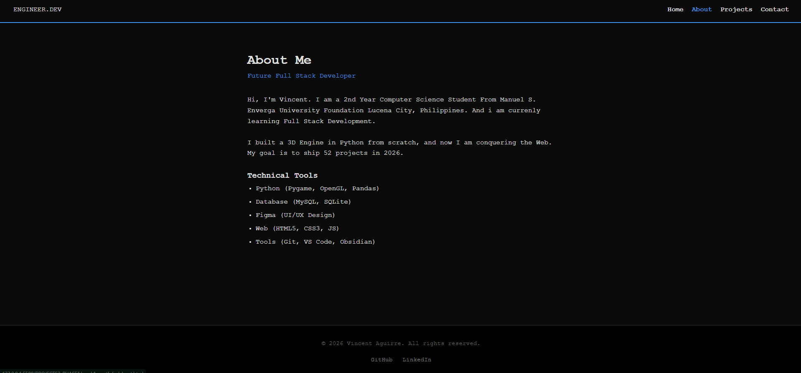

## 1. The Pivot (Design Refactor)
I shifted the design language of the Hero Section (`#hero`).
* **Previous State:** Centered text, typical of generic landing pages.
* **New State:** Left-Aligned (`flex-start`), constrained to a `max-width` of 1000px.
* **Why:** Left alignment improves readability for longer text and creates a more "document/technical" aesthetic, fitting the engineering persona.

```css
#hero {
    align-items: flex-start; /* The Pivot Point */
    text-align: left;
    padding: 0 2rem;
}
````

## 2. Architecture Scale (Multi-Page Support)

I moved the project from a Single-Page Application (SPA) structure to a **Multi-Page Architecture**.

### 2.1 The Fork

I cloned `index.html` to create `about.html`.

- **Strategy:** Both pages share the same `<head>` (CSS link) and `<nav>` structure, ensuring visual consistency without code duplication in the renderer.
    
- **Content:** `about.html` focuses on the "Bio" and "Tech Stack," allowing `index.html` to focus purely on "Projects."
    

### 2.2 The Navigation Logic (Deep Linking)

I had to update the Navigation Bar to support **Deep Linking**.

- **Problem:** Clicking "Projects" while on the `about.html` page would fail because `#projects` doesn't exist there.
    
- **Solution:** I updated the links to use absolute paths relative to the root:
    
    - `href="index.html#projects"` ensures the browser loads the home page _then_ scrolls to the target.
        

## 3. Visual Proof

**The New Hero (Left Aligned):** 

**The About Page:** 
