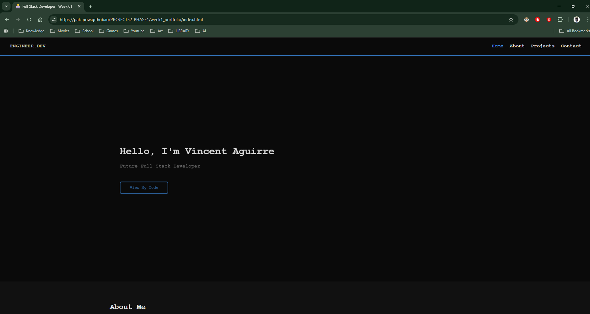

## 1. The Launch (Production Deployment)
Today marks the official release of **Project 52: Phase 1**.
I transitioned the environment from **Localhost** (Development) to **GitHub Pages** (Production).
* **The Pipeline:** Implemented a Continuous Deployment (CD) workflow where pushing to the `main` branch automatically triggers a build and deploy process via GitHub Actions.

## 2. The Architecture Patch (The Mission Hub)
Upon initial deployment, I encountered a **Routing Logic Error**.
* **Bug:** Accessing the root URL (`.../PROJECT52-PHASE1/`) displayed the `README.md` file instead of the website.
* **Diagnosis:** GitHub Pages defaults to rendering the README if no `index.html` is found in the root directory. My project was nested inside `/week1_portfolio/`.
* **Fix:** I engineered a **"Mission Control" Hub** at the root.
    * This acts as a **Level Select Screen**, allowing users to navigate to Week 1, and eventually Week 2-52.
    * This ensures the architecture is scalable for the entire year without needing to restructure old projects.

## 3. The Polish (Hub Micro-interactions)
I applied "Game Feel" principles to the Hub navigation buttons using CSS Transitions.

```css
/* The Hover Physics */
a:hover { 
    transform: translateY(-8px); /* Lift button up */
    background: white; 
    color: black; 
    transition: 0.2s ease;       /* Smooth interpolation */
}
````

## 4. Visual Proof

The Mission Control Hub (Live): 

The root entry point handling navigation to sub-projects.

Deployment Success: 

Green checkmark on GitHub Actions confirming a successful build.

