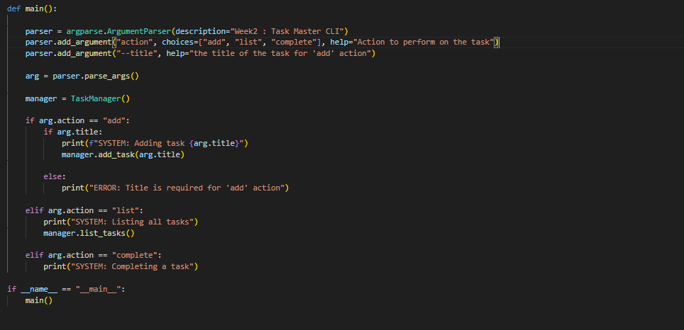

## 1. The Initiative

Week 02 begins. The objective is to shift from **Frontend** (HTML/CSS) to **Backend Logic** (Python).
I am building a **Command Line Interface (CLI)** Task Manager.
* **Why CLI?** GUI apps (Buttons/Windows) are heavy. CLI tools are fast, scriptable, and force me to understand how programs handle input/output at a raw level.

## 2. The Architecture
I established a clean MVC-style (Model-View-Controller) folder structure, separating the Logic (`src`) from the Storage (`data`).

```text
week02_taskmanager/
├── data/
│   └── tasks.json       # The Database (Empty for now)
├── src/
│   └── taskmaster.py    # The Engine
└── README.md            # The Contract
````

## 3. The Input Controller (Argparse)

The core challenge today was handling user input without a visual interface.

I used Python's native argparse library to act as the "Game Controller."

- **The Concept:** Instead of clicking a button labeled "Add," the user types `--add`. The parser listens for these "flags" and routes them to the correct function.
    
- **The Logic:**

``` Python
parser.add_argument("action", choices=["add", "list"], help="Action to perform")
parser.add_argument("--title", help="Task title")
``` 

## 4. Friction Point: The "One-Frame" Loop

I had to adjust my mental model from **Game Dev** to **Scripting**.

- **Game Dev:** `while True:` (Infinite Loop). The app stays open.
- **CLI Tool:** Run Once -> Execute -> Exit.
- **Adjustment:** I realized I don't need a "Main Loop." The operating system invokes the script, the script runs one specific action based on the arguments, and then terminates immediately.

## 5. Visual Proof

The Skeleton Test: 



Verifying that the script accepts arguments and prints feedback.
