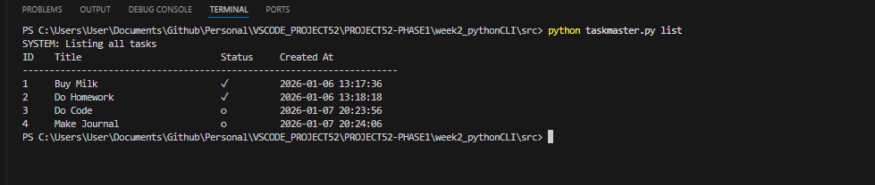

## 1. The Initiative
Today I upgraded the system from a simple **Logger** (Write-Only) to an **Interactive Database** (Read/Write/Update).
The goal was to implement the `complete` command, allowing the user to mark tasks as done.

## 2. The Algorithm (Linear Search)
The challenge was finding a specific task inside the list. I implemented a **Linear Search Algorithm**:
1.  **Iterate** through the list of dictionaries.
2.  **Compare** the user-provided `--id` with the current task's `id`.
3.  **Action:** If a match is found, update the boolean flag `completed` to `True`.
4.  **Break:** Stop the loop immediately to save resources (Optimization).

## 3. The Implementation
I had to update both the **Input Controller** (Argparse) and the **Logic Core** (TaskManager).

**The Input Upgrade:**
I added a typed argument `--id` to ensure strict integer validation.
```python
parser.add_argument("--id", type=int, help="Task ID (for 'complete')")
````

**The Logic Upgrade:**

``` Python
def complete_task(self, task_id):
    found = False
    for task in self.tasks:
        if task['id'] == task_id:
            task['completed'] = True
            task['status'] = "done"
            found = True
            break 
    
    if found:
        self.save_data()
```

## 4. Visual Proof

Task Completion: 




The CLI successfully locating Task ID 1 and updating the icon from ☐ to ✅.

Error Handling:


The system gracefully handling a request for a non-existent ID.
