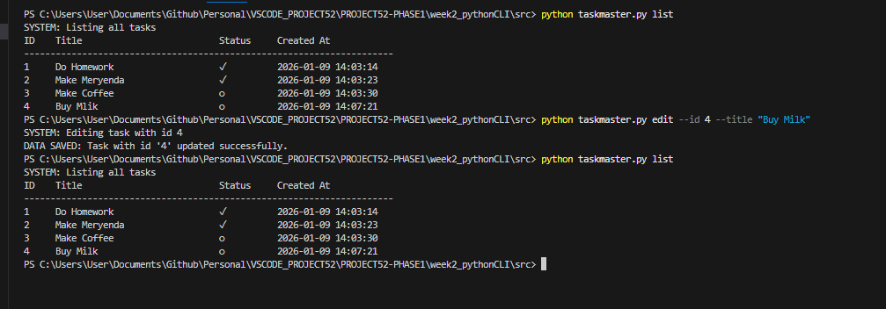

## 1. The Initiative
Today I finalized the application by implementing the **Edit** functionality.
I realized that while I could *Create*, *Read*, and *Delete*, I could not *Update* a task's content. This meant users had to delete and re-create tasks just to fix a simple typo, which is a poor User Experience (UX).

## 2. The Logic (In-Place Update)
The `edit` function uses the same search algorithm as `complete` and `delete` (Linear Search by ID), but performs a **variable swap** instead of a status change or removal.

```python
def edit_task(self, task_id, new_title):
    for task in self.tasks:
        if task['id'] == task_id:
            task['title'] = new_title # The Hot-Fix
            break
````

## 3. Router Logic Upgrade

I updated the `main()` function to enforce strict input requirements for the edit command. Unlike `delete` (which only needs an ID) or `add` (which only needs a Title), `edit` requires **both**:

- `--id`: To locate the record in the database.
    
- `--title`: To provide the new string data.

``` Python
elif args.action == "edit":
    if args.id and args.title:
        manager.edit_task(args.id, args.title)
    else:
        print("❌ ERROR: 'edit' requires both --id AND --title.")
```

## 4. Visual Proof

The Typo Fix: 



Successfully renaming "Buy Mlik" to "Buy Milk" without altering the ID or Status.
