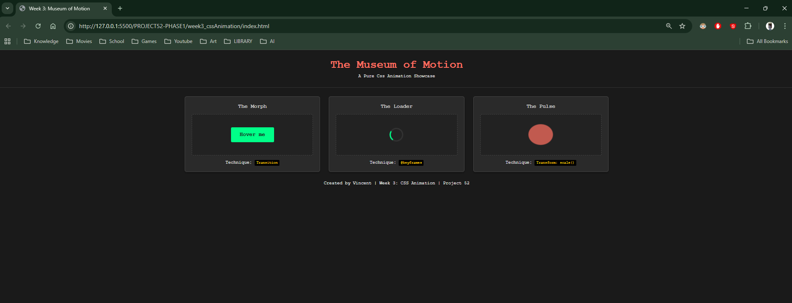

## 1. The Initiative
Week 3 focuses on **Motion Design**.
The goal is to move away from static layouts and build a "Museum of Motion"—a gallery showcasing pure CSS animation techniques without any JavaScript.
Today, I built the gallery structure and the first three exhibits.

## 2. The Concepts
I learned the distinction between two core CSS tools:
1.  **Transitions (`transition`):** Passive animation. The browser interpolates between two states (e.g., A to B) only when a trigger happens (like `:hover`).
2.  **Animations (`@keyframes`):** Active animation. The browser executes a complex script of movements (A -> B -> C -> A) continuously, independent of user interaction.

## 3. The Exhibits
I implemented three common UI patterns:

### Exhibit 01: The Morph (Transition)
* **Behavior:** On hover, the button changes color, scales up, and tilts.
* **Code:** `transition: all 0.3s ease-in-out;`
* **Use Case:** Interactive buttons and links.

### Exhibit 02: The Loader (Linear Loop)
* **Behavior:** An infinite 360-degree rotation at constant speed.
* **Code:** `animation: spin 1s linear infinite;`
* **Use Case:** Loading spinners and background ambiance.

### Exhibit 03: The Pulse (Organic Loop)
* **Behavior:** A circle that grows and shrinks rhythmically.
* **Key Insight:** Used `animation-direction: alternate` to make the animation play forward (grow) and then backward (shrink), creating a smooth breathing effect.
* **Code:** `animation: heartbeat 1.5s ease-in-out infinite alternate;`

## 4. Friction Point
I encountered a layout issue where the exhibit elements were falling out of their "Display Cases" (CSS Grid cards).
* **The Fix:** I realized I had closed the `div` tags too early in the HTML. I moved the buttons *inside* the `.display-case` containers to respect the flexbox centering.

## 5. Visual Proof
*The gallery currently displaying the three active animations.*

