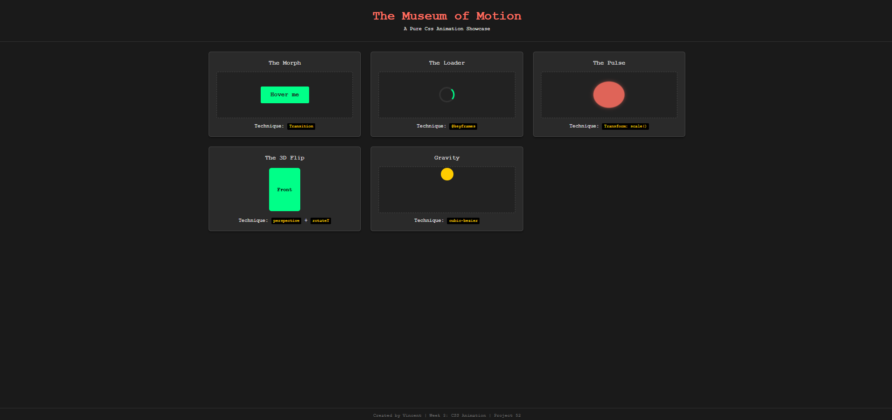

## 1. The Initiative
Day 2 focused on advanced motion concepts: **Dimensionality** and **Physics**.
I moved beyond 2D translation into 3D space and implemented custom timing functions to mimic real-world weight.

## 2. The Concepts

### Concept A: The 3D Stage (The Card Flip)
Rendering 3D in a 2D browser requires a specific hierarchy of CSS properties:
1.  **The Scene (`perspective: 1000px`):** Establishes the vanishing point. Without this, 3D rotations look flat.
2.  **The Object (`transform-style: preserve-3d`):** Tells the browser to render children in their own 3D plane, not flatten them against the parent.
3.  **The Visibility (`backface-visibility: hidden`):** Essential for the "card flip" effect. It hides the back of an element when it is rotated 180 degrees away from the camera.

### Concept B: CSS Physics (The Bounce)
Standard easing (`ease`, `linear`) feels robotic. To simulate gravity, I used **Cubic Bezier** curves.
* **The Trick:** I used `animation-direction: alternate` combined with a custom curve (`cubic-bezier(0.6, 0.05, 0.4, 1)`).
* **The Result:** The animation plays "Slow Start -> Fast End" on the way down (acceleration), and "Fast Start -> Slow End" on the way up (deceleration), perfectly mimicking a bouncing ball.

## 3. The Exhibits

### Exhibit 04: The 3D Flip
* **Technique:** `rotateY(180deg)` on hover.
* **Challenge:** Ensuring the text on the back card wasn't mirrored. I solved this by pre-rotating the back face 180 degrees in CSS.

### Exhibit 05: Gravity
* **Technique:** `transform: translateY()` with custom acceleration curves.
* **Visual:** A yellow ball that feels heavy, not floaty.

## 4. Visual Proof
*The gallery now features 5 distinct motion behaviors.*

