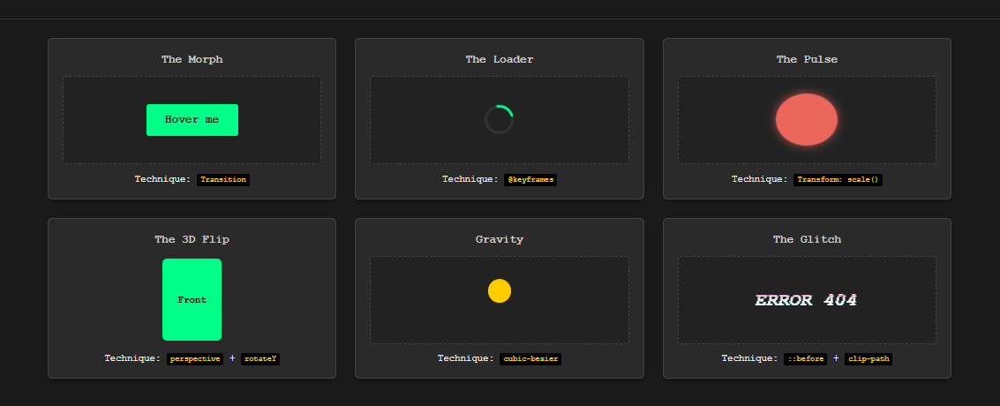

## 1. The Initiative
Day 3 was about **Chaos** and **Polish**.
I implemented the final exhibit: a "Glitch" text effect that mimics digital corruption. This required advanced CSS techniques that manipulate bits of the element without adding extra HTML tags.

## 2. The Concepts

### Concept A: The Ghost Layers (::before / ::after)
Instead of adding `` tags for the glitch layers, I used CSS Pseudo-elements.
* **Technique:** `content: attr(data-text);`
* **Why?** This pulls the text from the HTML attribute `data-text="ERROR 404"`. If I change the HTML text, the glitch layers update automatically. This keeps the HTML clean (Dry Principle).

### Concept B: The Slicing (clip-path)
To create the "fractured" look, I used `clip-path: inset(...)`.
* Imagine placing a stencil over the text. You only see what's under the hole.
* By animating the `inset` values rapidly in a `@keyframes` loop, the text appears to be tearing apart randomly.

### Concept C: "Divitis" vs. Animation Handles
I observed a pattern of nesting multiple `div`s (Wrapper -> Scene -> Object -> Face).
* **The Realization:** While semantic HTML prefers minimal nesting, advanced animation requires these extra layers to serve as "handles" or "rigs."
* **The Rule:** One div controls the **Scene** (Perspective), one controls the **Object** (Rotation), and others control the **Faces** (Texture).

## 3. The Exhibits

### Exhibit 06: The Glitch
* **Visual:** Text that vibrates with Cyan/Magenta sub-layers and random slicing.
* **Key Code:** `animation: glitch-anim 2.5s infinite linear alternate-reverse;`

## 4. Visual Proof
*The final gallery with the Glitch effect active.*

