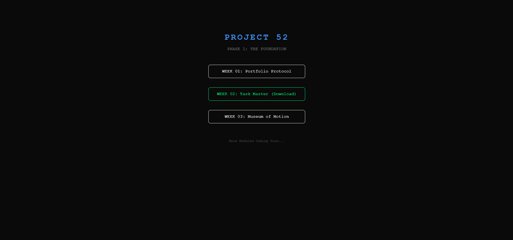

## 1. The Initiative
Today was **Launch Day**.
I finalized the "Museum of Motion" and integrated it into the main Project 52 Hub. The goal was to ensure that a visitor landing on my root domain can navigate to both my web projects and my software downloads seamlessly.

## 2. The Architecture (The "Hub" Model)
I updated the root `index.html` to serve as a traffic controller.
* **Internal Routing:** For web projects (like Week 1 & 3), I used relative paths (`./week03_animation/`) because GitHub Pages serves sub-folders automatically.
* **External Routing:** For software tools (like Week 2 Python), I linked directly to the **GitHub Release Tag**.
    * *Why?* Browsers cannot "run" Python. Sending users to the source code folder is confusing. Sending them to a dedicated "Release" page with a `.zip` download is the professional standard.

## 3. The Code Update
I refactored the landing page CSS to distinguish between "Viewable" projects and "Downloadable" tools.
```css
/* Visual cue for CLI tools */
.cli-link {
    border-color: #00ff88;
    color: #00ff88;
}
````

## 4. Visual Proof

_The updated Project Hub, serving as the gateway to the Project 52 ecosystem._


