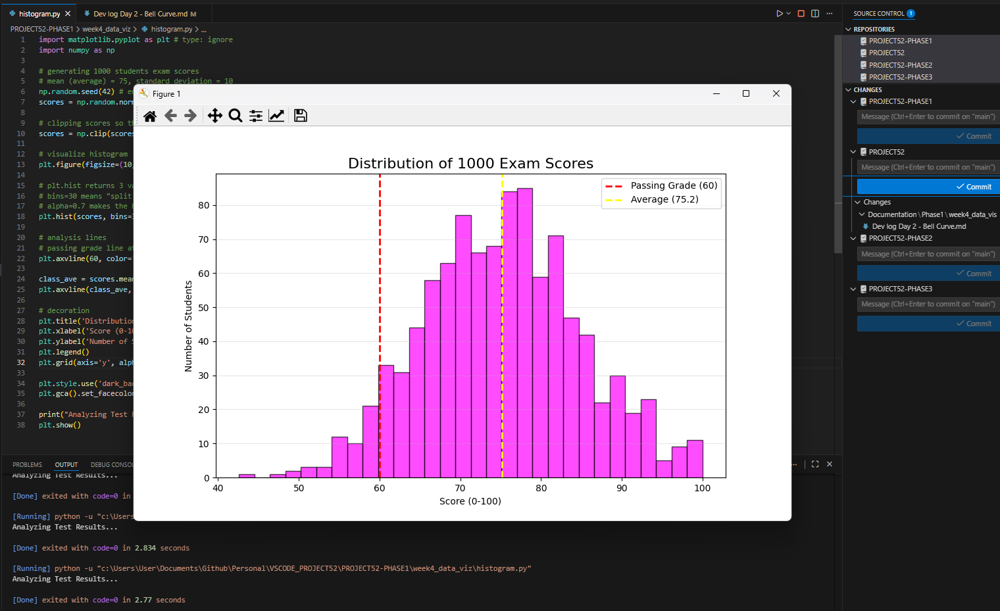

## 1. The Initiative
Day 2 focused on **Frequency Distributions**.
While line charts show history, they don't answer questions like "What is 'normal'?" or "How rare is an outlier?". To solve this, I built a simulation of 1,000 student exam scores using a **Histogram**.

## 2. The Concepts

### Concept A: The Normal Distribution (The Bell Curve)
I used `np.random.normal(loc, scale, size)` to generate the data.
* **Loc (Mean):** 75. This is the center of the bell.
* **Scale (Standard Deviation):** 10. This determines how "fat" or "skinny" the bell is.
* **Result:** Most scores clustered between 65-85, with very few falling below 50 or above 95. This mimics natural phenomena (IQ, height, errors).

### Concept B: Binning
A histogram groups continuous data into "buckets" (bins).
* **Code:** `plt.hist(scores, bins=30)`
* **Insight:** Choosing the right number of bins is an art. Too few (e.g., 5) hides the shape. Too many (e.g., 100) makes it look like jagged noise. 30 was the sweet spot for 1,000 data points.

### Concept C: Reference Lines (`axvline`)
A distribution is meaningless without context. I added vertical lines to mark:
1.  **The Passing Grade (60):** Visualizing the cutoff.
2.  **The Average:** Visualizing the center of the crowd.

## 3. The Code Specimen
*Generating the Gaussian data:*
```python
# Generate 1000 scores centered at 75
scores = np.random.normal(75, 10, 1000)

# Clip outliers to realistic bounds (0-100)
scores = np.clip(scores, 0, 100)
````

## 4. Visual Proof

_The histogram showing the bell curve of student performance._


