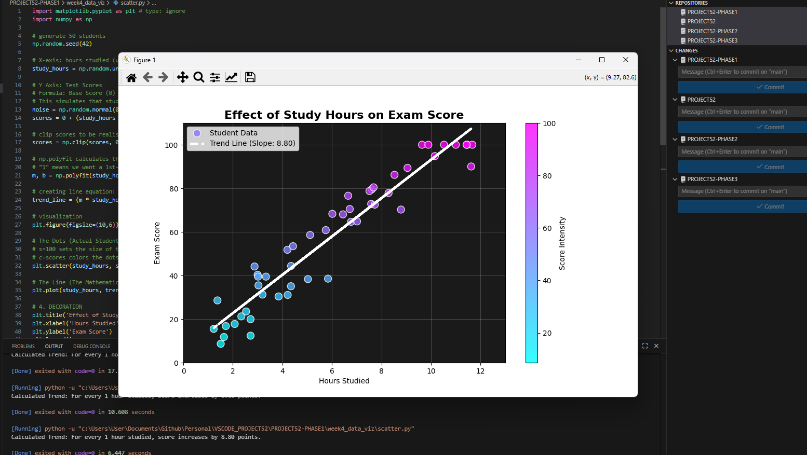

## 1. The Initiative
Day 3 focused on **Correlation** (Cause and Effect).
I built a simulation to answer: *"Does studying affect grades?"*
Unlike the Line Chart (Time) or Histogram (Frequency), the Scatter Plot reveals the relationship between two different variables (Hours vs. Scores).

## 2. The Concepts

### Concept A: Scatter Plots (`plt.scatter`)
* **Visual:** Plots individual data points as independent dots.
* **Insight:** Allows us to see the "cloud" of data. I added a `c=scores` argument to color-code the dots (Cyan = Low Score, Purple = High Score), adding a 3rd dimension of information to a 2D chart.

### Concept B: Linear Regression (`np.polyfit`)
* **The Math:** This function calculates the "Line of Best Fit" (Slope `m` and Intercept `b`) that minimizes the distance to all points.
* **The Code:** `m, b = np.polyfit(x, y, 1)` (The `1` stands for 1st-degree polynomial, i.e., a straight line).
* **Result:** A mathematical trend line that proves the correlation amidst the noise.

### Concept C: Axis Locking
* **Problem:** The random simulation initially created "negative study hours" (-15 hours), which is impossible.
* **Solution:** I used `plt.xlim(0, 13)` and `plt.ylim(0, 100)` to force the camera to start strictly at zero, ensuring the data visualization reflects reality.

## 3. The Code Specimen
*Calculating the trend line:*
```python
# Calculate slope (m) and intercept (b)
m, b = np.polyfit(study_hours, scores, 1)

# Generate the line for plotting
trend_line = (m * study_hours) + b
````

## 4. Visual Proof

_The scatter plot showing a strong positive correlation between study time and test scores._


