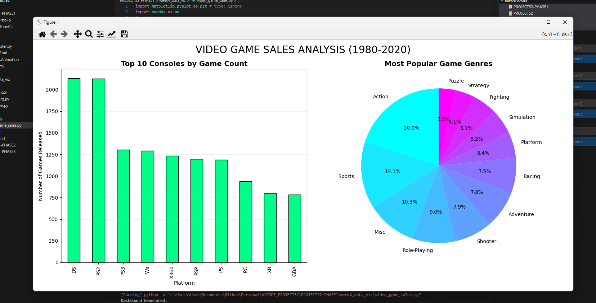

## 1. The Initiative
Week 4 concluded with a "Bonus Level."
After spending 5 days visualizing synthetic (random) data, I challenged myself to analyze a **Real World Dataset**. I downloaded the **Video Game Sales** dataset from Kaggle to answer actual questions about the gaming industry, such as "Which console has the largest library?" and "What is the dominant genre?"

## 2. The New Weapon: Pandas
I integrated **Pandas** (`import pandas as pd`), the industry-standard library for data manipulation.
* **The DataFrame:** Pandas turns a CSV file into a programmable Excel sheet called a DataFrame (`df`).
* **Data Hygiene:** Used `df.dropna(inplace=True)` to instantly remove any rows with missing data (cleaning the dataset).
* **Analysis:** Used `df['Column'].value_counts()` to count frequencies instantly—a task that would take 20+ lines of raw Python loop code.

## 3. The Challenge: Path Context
I encountered a `FileNotFoundError` because VS Code's terminal root was different from the script's location.
* **The Fix:** I implemented a "robust path" solution using the `os` library.
* **Logic:** Instead of hardcoding `"dataset/vgsales.csv"`, I calculated the absolute path relative to the script file (`__file__`). This ensures the code runs correctly on any machine, regardless of where the terminal is open.

## 4. The Code Specimen
*The robust path loading and Pandas plotting one-liner:*
```python
# 1. ROBUST PATH GENERATION (Fixing FileNotFoundError)
script_dir = os.path.dirname(os.path.abspath(__file__))
file_path = os.path.join(script_dir, "dataset", "vgsales.csv")

# 2. PANDAS + MATPLOTLIB INTEGRATION
# Pandas has a built-in .plot() wrapper that talks to Matplotlib
platform_counts.plot(kind='bar', ax=axs[0], color='#00ff88')
````

## 5. Visual Proof
_The final dashboard analyzing 16,000+ video game sales records from 1980-2020._


