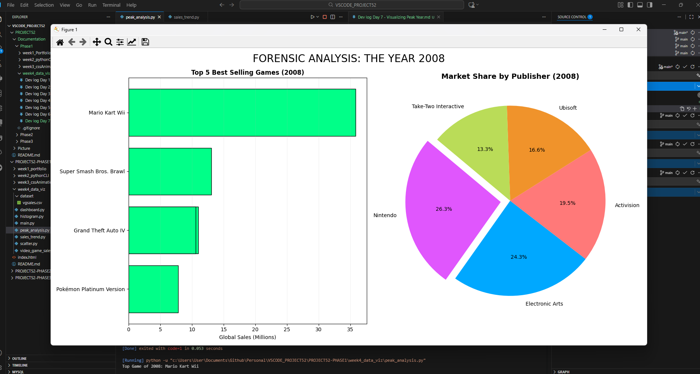

## 1. The Initiative (The Finale)
Day 7 was the culmination of the Data Visualization module.
The goal was to move beyond static snapshots and analyze **Trends over Time**.
I used the `vgsales.csv` dataset to perform a "Time Travel" analysis, identifying the Golden Age of gaming (2008) and then performing a "Forensic Deep Dive" to understand *why* that year was the peak.

## 2. The Concepts

### Concept A: Aggregation (`groupby`)
To visualize 30 years of history, I couldn't plot every single receipt.
* **The Tool:** `df.groupby('Year').sum()`
* **The Result:** It collapsed 16,000+ rows into ~40 rows (one per year), allowing me to plot the "Global Sales" line chart and clearly see the rise and fall of the industry.

### Concept B: The Filter (Drill Down)
Once I identified **2008** as the peak year, I needed to isolate it.
* **The Code:** `df_2008 = df[df['Year'] == 2008]`
* **The Logic:** This created a new sub-dataframe containing *only* the transactions from that specific year, allowing for focused analysis without noise from other eras.

### Concept C: Ranking (`sort_values`)
To find the "Kings of 2008," I sorted the data.
* **The Code:** `df_2008.sort_values(by='Global_Sales', ascending=False)`
* **The Insight:** This revealed that *Mario Kart Wii* was the #1 game, and **Nintendo** was the dominant publisher, holding a massive slice of the market share.

## 3. The Code Specimen
*The forensic filter and ranking logic:*
```python
# 1. Zoom in on the peak year
df_2008 = df[df['Year'] == 2008]

# 2. Find the top 5 Publishers by Sales
top_publishers = df_2008.groupby('Publisher')['Global_Sales'].sum().sort_values(ascending=False).head(5)
````

## 4. Visual Proof

_The forensic analysis showing Nintendo's absolute dominance during the 2008 peak._



