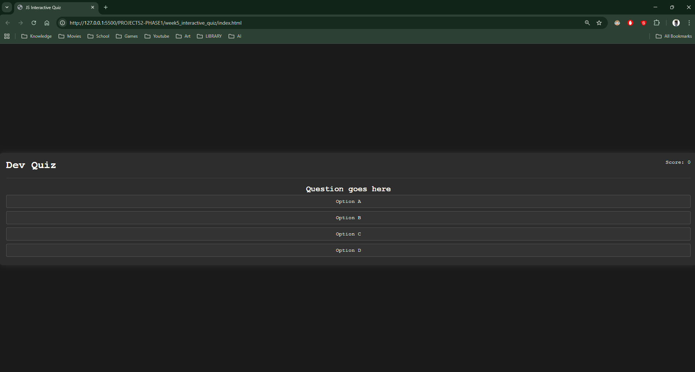

## 1. The Initiative
Week 5 marks the transition from Python (Backend) to **JavaScript (Frontend)**.
The goal is to build a "Single Page Application" (SPA) — a quiz that updates dynamically without ever reloading the browser.
Day 1 focused on constructing the physical interface (HTML) and the visual styling (CSS).

## 2. The Concepts

### Concept A: Semantic HTML Structure
I built the game board using a container-based layout:
* **`.app-container`**: The main wrapper that holds everything.
* **`.quiz-header`**: Contains the Title and Score.
* **`.quiz-card`**: The active area where questions and buttons live.
* **`onclick="checkAnswer(this)"`**: A crucial HTML attribute. It passes the specific button element (`this`) to the JavaScript function when clicked, allowing the code to know *exactly* which option the user chose.

### Concept B: CSS Flexbox Centering
To make the quiz look like a modern app, I used Flexbox on the `body` to perfectly center the card in the viewport:
```css
body {
    display: flex;
    justify-content: center; /* Horizontal Center */
    align-items: center;     /* Vertical Center */
    height: 100vh;           /* Full Viewport Height */
}
````

### Concept C: State Styling

I prepared CSS classes for future JavaScript logic:

- **`.hide`**: `display: none;` (To hide elements like the "Next" button).
- **`.correct`**: Green background (To mark right answers).
- **`.wrong`**: Red background (To mark wrong answers).
    By toggling these classes with JS later, I can instantly change the game state visually.

## 3. The Code Specimen

_The button structure awaiting JavaScript logic:_

``` HTML
<div class="options-container">
    <button class="btn" onclick="checkAnswer(this)">Option A</button>
    <button class="btn" onclick="checkAnswer(this)">Option B</button>
</div>
```

## 4. Visual Proof

_The static interface loaded in the browser_


