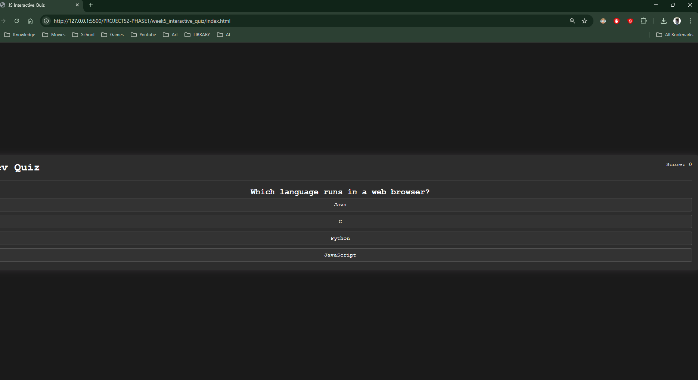

## 1. The Initiative
Day 2 was about **Data Injection**.
Yesterday, the HTML was static (hardcoded text). Today, I wrote the JavaScript logic to dynamically inject content into the page.

## 2. The Concepts

### Concept A: The Data Structure (Array of Objects)
I stored the quiz data in a structured format:
```javascript
const questions = [
    {
        question: "What is 2+2?",
        options: ["3", "4", "5", "6"],
        correct: "4"
    }
];
````

This is the standard pattern for web apps: separate the **Data** from the **Display**.

### Concept B: The Injection Loop
To update the buttons, I used `forEach`:

```JavaScript
optionButtons.forEach((button, index) => {
    button.innerText = currentQuestionData.options[index];
});
```

This loops through each button and assigns it the corresponding text from the data array.
### Concept C: The Silent Bug
I encountered a logic error where the buttons wouldn't update.

- **The Cause:** A typo in the HTML class name (`options-contatiner` vs `options-container`).
- **The Fix:** Corrected the HTML to match the JavaScript selector.
- **The Lesson:** `querySelectorAll` returns an empty list if the name is wrong, causing the code to fail silently rather than crashing.

## 3. Visual Proof
_The interface now successfully loading data from JavaScript._


