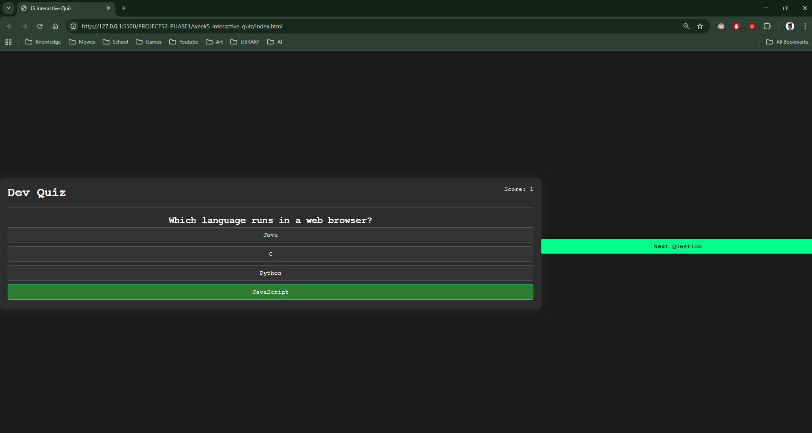
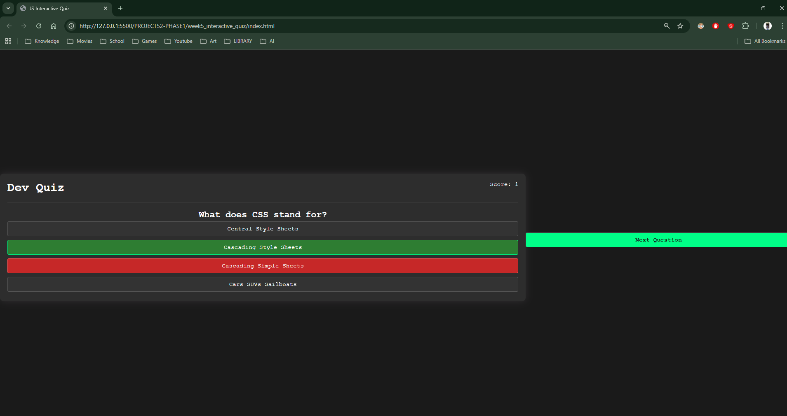

## 1. The Initiative
Day 3 focused on **User Interaction**.
I programmed the `checkAnswer()` function to handle the core gameplay loop: Click -> Judge -> Feedback -> Score.

## 2. The Concepts

### Concept A: Class Toggling (Visual Feedback)
Instead of painting colors with JS (e.g., `style.backgroundColor = 'red'`), I used **Class Toggling**:
```javascript
selectedButton.classList.add('correct');
````

This is cleaner because it keeps the styling rules in CSS. JS simply "tags" the element, and CSS handles the painting.

### Concept B: The Logic Gate (If/Else)
I implemented the core game rule:
```JavaScript
if (selectedAnswer === correctAnswer) {
    // Win State: Green Color + Score Up
} else {
    // Lose State: Red Color + Show Right Answer
}
```

### Concept C: Board Locking (UX)
To prevent cheating (clicking the right answer _after_ getting it wrong), I disabled all buttons immediately after the first click:
``` JavaScript

optionButtons.forEach(btn => {
    btn.disabled = true;
});
```

## 3. Visual Proof

_The application showing the "Wrong Answer" state: The user clicked 'Java' (Red), so the app revealed 'JavaScript' (Green) as the correct choice._





