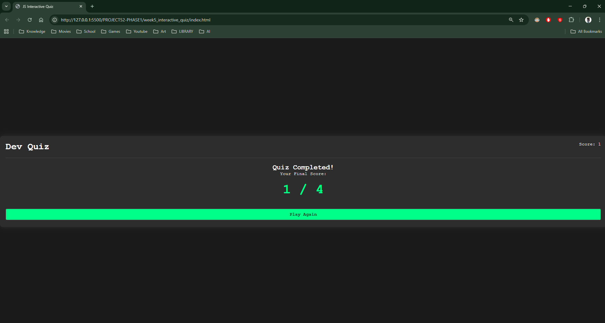

## 1. The Initiative
Day 4 was about closing the loop.
A game isn't finished until it has an Ending and a Restart button. I implemented the **Result Screen** and the **Restart Logic** to create an infinite game loop without page reloads.

## 2. The Concepts
### Concept A: The View Switch (SPA Behavior)
Modern web apps don't reload pages to show new screens. They just hide one `div` and show another.
```javascript
// Switching Views
quizCard.classList.add('hide');   // Hide Question
resultCard.classList.remove('hide'); // Show Result
````

### Concept B: Template Literals
To display the score dynamically, I used JavaScript's backtick syntax:

``` JavaScript
finalScoreElement.innerText = `${score} / ${questions.length}`;
```

This automatically inserts the variables into the string, avoiding messy `+` concatenation.
### Concept C: State Reset

The `restartQuiz()` function is critical. It manually resets all variables (`score = 0`, `index = 0`) before showing the first question again. If I missed this, the user would start the next game with their old score!

## 3. The Code Specimen
_The logic that decides if the game is over:_
``` JavaScript
if (currentQuestionIndex < questions.length) {
    loadQuestion(); // Keep playing
} else {
    showResults();  // End game
}
```

## 4. Visual Proof
_The final Result Screen, dynamically showing the user's score._


