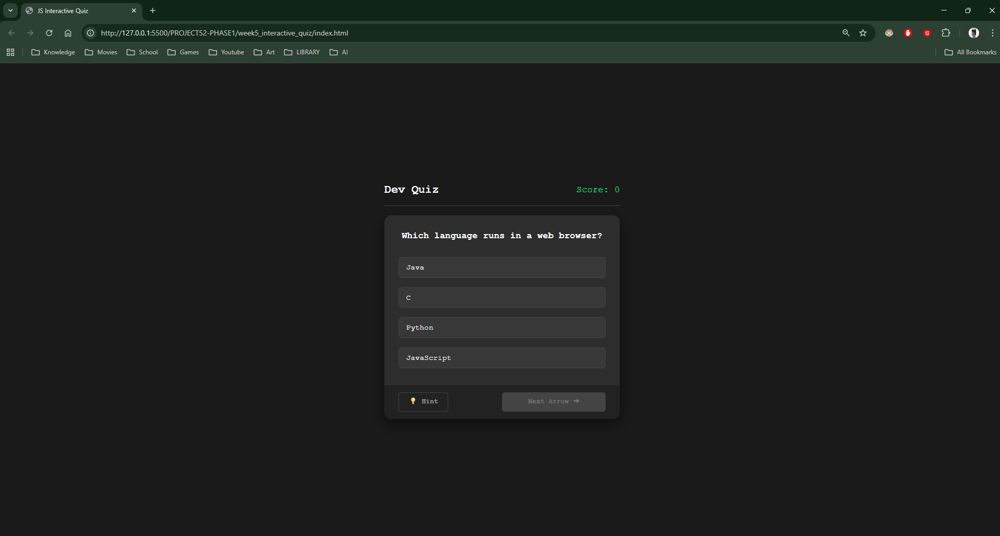
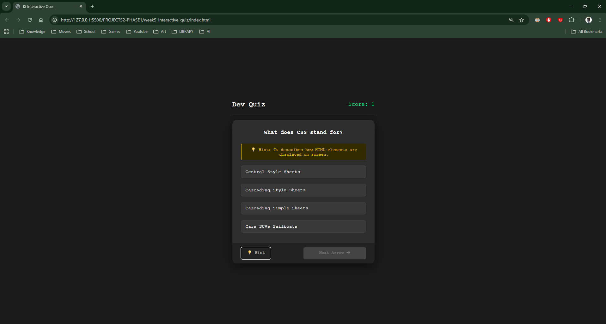
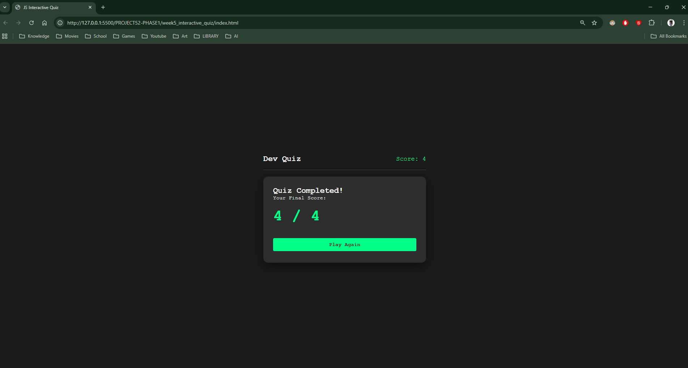

## 1. The Initiative
Day 5 wasn't about adding new features—it was about **Professional Polish**.
I transformed the app from a basic "student project" look into a modern, production-grade interface. The goal was to align buttons, organize the layout into a "Card" structure, and ensure the User Experience (UX) felt stable.

## 2. The Concepts

### Concept A: The Card Architecture
I moved from loose elements to a strict hierarchy:
* **Container** (The alignment wrapper)
* **Card Header** (Title & Score)
* **Card Body** (Questions & Hints)
* **Card Footer** (Control Buttons)
This structure prevents buttons from "jumping around" when content changes size.

### Concept B: The "Ghost Code" Bug
I encountered a stubborn alignment issue where the "Next" button refused to sit on the same line as the "Hint" button.
* **The Symptom:** One button was 20px lower than the other.
* **The Cause:** Duplicate CSS rules. An old `.next-btn { margin-top: 20px; }` block was hidden lower in the file, overriding my new Flexbox settings.
* **The Fix:** Deleted the legacy code and used `align-items: center` in the footer flex container.

### Concept C: Visual Feedback States
I implemented a "Grayed Out" state for the Next button:
```css
.next-btn:disabled {
    background-color: #444;
    cursor: not-allowed;
}
````

This tells the user "You can't click this yet," improving the game flow significantly compared to just hiding the button.

## 3. Visual Proof
_The final, pixel-perfect interface with the new "Dark Glass" aesthetic and perfectly aligned footer._







