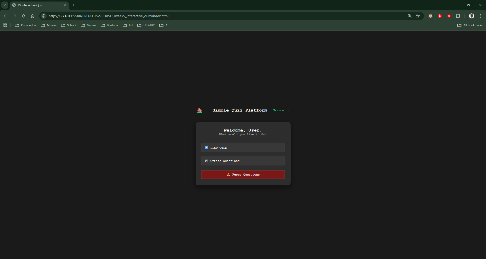
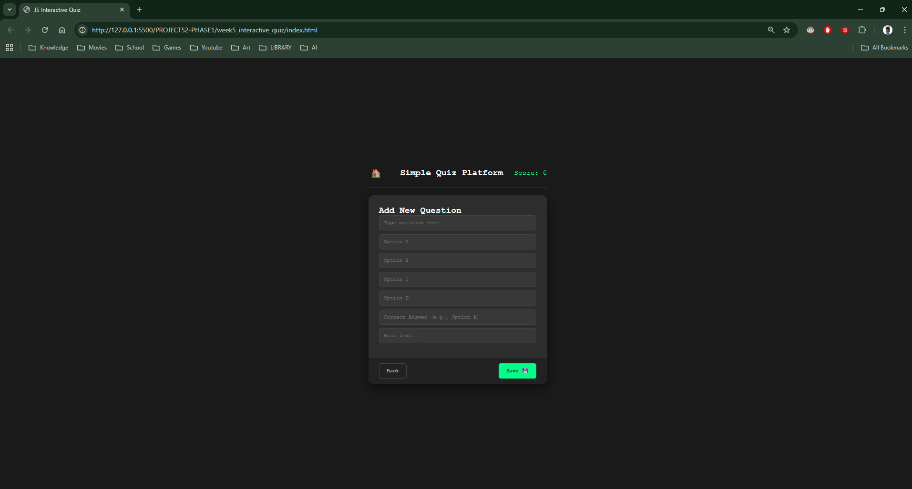
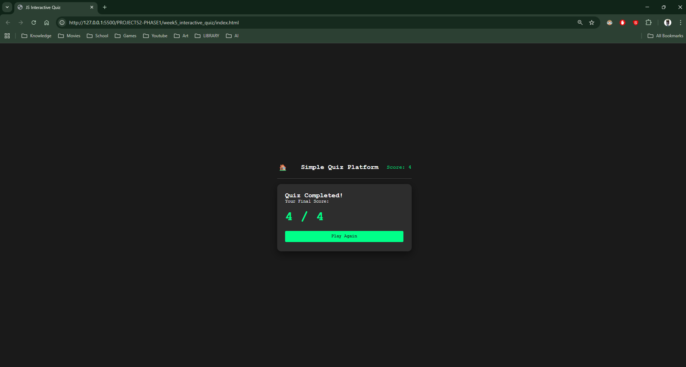

## 1. The Initiative
Day 6 was about transforming the app from a static "consumption" experience into a dynamic "creation" tool.
I built a **Creator Admin Panel** that allows users to add their own questions. This required a complete architectural overhaul, moving from a single-screen app to a **Multi-Screen SPA** (Home, Creator, Game).

## 2. The Concepts
### Concept A: Local Storage (Persistence)
To make user data survive a page refresh, I used the browser's native database:
```javascript
// Saving Data
localStorage.setItem("myQuizQuestions", JSON.stringify(questions));

// Loading Data
const stored = localStorage.getItem("myQuizQuestions");
if (stored) {
    questions = JSON.parse(stored);
}
````

### Concept B: Selector Specificity (Bug Fix)
I encountered a "Selector Collision" where the Home Screen buttons were being overwritten by the Game Logic because they shared the class `.option-btn`.

- **The Fix:** I updated the JS to target only specific children: `document.querySelectorAll("#game-screen .option-btn")`.

### Concept C: Keyboard Navigation (UX)
To speed up data entry, I added an event listener for the `Enter` key. This automatically moves the focus to the next input field, mimicking the behavior of professional forms (like Typeform).

## 3. The Code Specimen
_The logic that "listens" for the Enter key to improve workflow:_
``` JavaScript
creatorInputs.forEach((input, index) => {
    input.addEventListener('keydown', (e) => {
        if (e.key === 'Enter') {
            e.preventDefault(); 
            const nextInput = creatorInputs[index + 1];
            if (nextInput) nextInput.focus(); // Jump to next
            else saveQuestion(); // Or Save if at the end
        }
    });
});
```

## 4. Visual Proof
_The new Home Screen with options to Play, Create, or Reset data._







