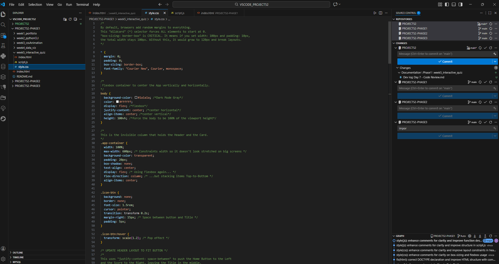

## 1. The Initiative
Day 7 was dedicated to the **Code Autopsy**.
We halted development to perform a line-by-line analysis of the entire codebase. The goal was to solidify the mental models behind Single Page Applications (SPAs), CSS Layouts, and Data Persistence before moving back to Python.

## 2. The Concepts

### Concept A: The SPA Architecture (HTML)
We analyzed how a single `index.html` file can behave like multiple pages.
* **Technique:** Creating distinct "Screens" (`#home-screen`, `#game-screen`) wrapped in `div`s.
* **Mechanism:** Using a utility CSS class (`.hide { display: none; }`) to toggle visibility instantly, avoiding page reloads.

### Concept B: The Box Model & Flexbox (CSS)
We deconstructed the layout engine.
* **Global Reset:** `* { box-sizing: border-box; }` ensures padding doesn't break element width.
* **Flexbox:** Used `justify-content: space-between` to create the "Header" and "Footer" layouts, pushing content to the edges automatically.

### Concept C: The State Machine (JavaScript)
We reviewed how the app remembers "where it is."
* **State Variables:** `currentQuestionIndex` and `score` track the user's progress.
* **Persistence:** The `localStorage` protocol allows the app to save the `questions` array to the browser's hard drive, converting it to a String (`JSON.stringify`) for storage and back to an Object (`JSON.parse`) for use.

## 3. The Code Specimen
*The navigation logic that powers the "Enter Key" workflow for rapid data entry:*
```javascript
creatorInputs.forEach((input, index) => {
    input.addEventListener('keydown', (e) => {
        if (e.key === 'Enter') {
            e.preventDefault(); 
            const nextInput = creatorInputs[index + 1];
            if (nextInput) nextInput.focus(); // Jump focus
            else saveQuestion(); // Save on last input
        }
    });
});
````

## 4. Visual Proof



