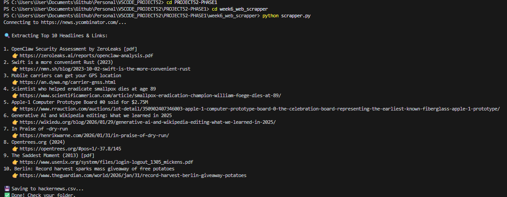

## 1. The Initiative
Day 1 of Week 6 focused on **Programmatic Data Retrieval**.
Instead of manually visiting a website to copy information, I built a Python script that acts as a user agent. It connects to *Hacker News*, reads the raw HTML, parses the DOM tree, and extracts specific metadata (Headlines and Links) into a structured dataset.

## 2. The Concepts

### Concept A: The Handshake (Requests)
We used the `requests` library to send an HTTP GET request to the server.
* **Status Code 200:** The door is open.
* **Status Code 403:** The door is locked (bot detected).
* **Response Text:** The raw, unstructured HTML string returned by the server.

### Concept B: The Parser (BeautifulSoup)
Raw HTML is just a giant string of text. To find specific data, we used `BeautifulSoup` to convert that string into a navigable tree object.
* **Selection:** Used CSS selectors (`span.titleline`) to pinpoint the exact HTML elements containing the headlines.
* **Traversal:** Used `.find('a')` to dig inside the parent span to get the text and the `href` (link).

### Concept C: Persistence (CSV)
Printing to the console is temporary. I implemented the `csv` module to save the harvest.
* **`newline=''`**: Prevents blank rows between data in Windows Excel.
* **`encoding='utf-8'`**: Ensures emojis and special characters don't break the file.

## 3. The Code Specimen
*The extraction loop that separates the headline text from the clickable link:*
```python
for i, headline in enumerate(headlines[:10], 1):
    # 1. Get the Visible Text
    text = headline.find("a").get_text()
    
    # 2. Get the Hidden Link (Attribute)
    link = headline.find("a")['href']
    
    # 3. Structure for CSV
    data_to_save.append([i, text, link])
````

## 4. The Output
_A sample of the `hackernews.csv` file generated by the bot:_




