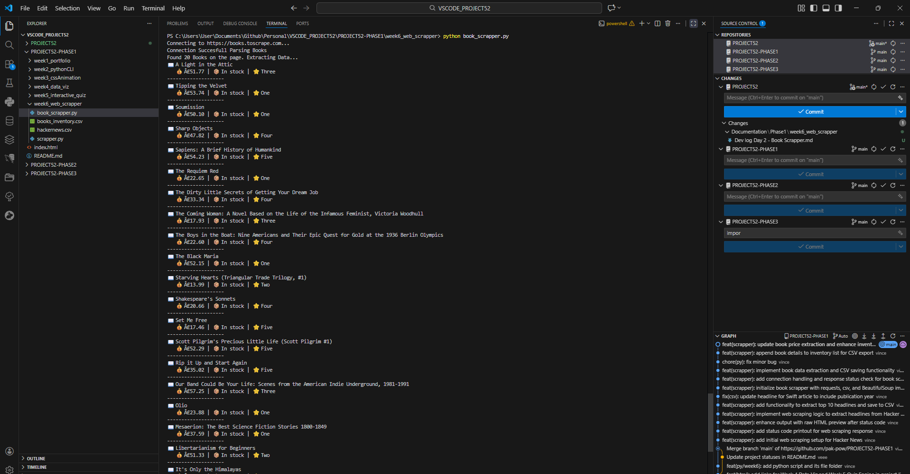
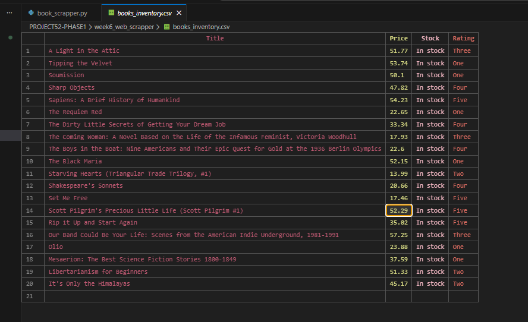

## 1. The Initiative
Day 2 focused on **Structured Data Extraction**.
Unlike the simple list from Day 1, today's target (*Books to Scrape*) required navigating "Cards"—containers holding multiple related data points. I built a script that iterates through these containers to extract product details and, critically, **cleans the data** before saving it.

## 2. The Concepts

### Concept A: The "Card" Strategy (Container Iteration)
Instead of searching for all titles and all prices separately (which risks misalignment), I selected the container first:
```python
# Find the box that holds ONE book
books = soup.select("article.product_pod")

# Then look inside THAT box only
for book in books:
    title = book.find("h3").text
````

This ensures that the price I find belongs to the title I just found.

### Concept B: Attribute Extraction
Sometimes text is hidden or cut off. I learned to extract data from HTML attributes instead of the visible text:

- **Full Title:** Stored in the `title="..."` attribute of the `<a>` tag.
- **Rating:** Stored as a class name (`class="star-rating Three"`).    

### Concept C: Data Cleaning (ETL)
Raw data is often "dirty" (e.g., `£51.77`). To make it usable for analysis, I performed a transformation:

1. **Strip:** Removed the currency symbol (`replace('£', '')`).    
2. **Cast:** Converted the string to a decimal number (`float()`).


## 3. The Code Specimen
_The logic that transforms a raw price string into a calculable number:_

``` Python
# Raw: "£51.77"
raw_price = book.select_one(".price_color").text

# Clean: "51.77" -> 51.77
price_text = raw_price.replace('£', '')
price = float(price_text)
```

## 4. The Output
_A sample of the inventory file, ready for financial analysis:_

``` excel
Title,Price,Stock,Rating
A Light in the Attic,51.77,In stock,Three
Tipping the Velvet,53.74,In stock,One
Soumission,50.10,In stock,One
```



