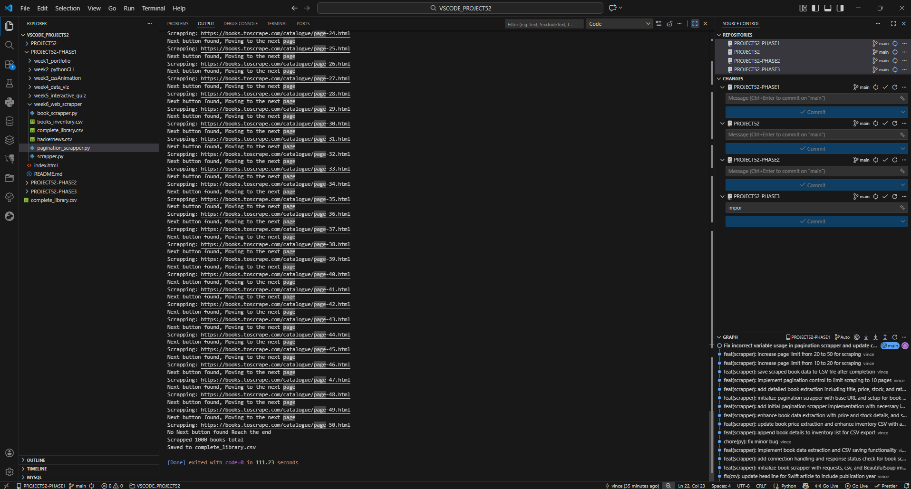
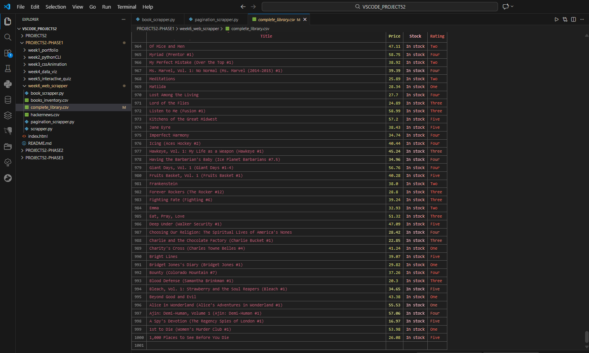

## 1. The Initiative
Day 3 focused on **Automated Navigation**.
We moved beyond single-page scraping to handle "Pagination" (Next Buttons). This required transforming our linear script into a `while` loop that dynamically updates the target URL based on the `href` of the navigation elements found in the DOM.

## 2. The Concepts

### Concept A: The Infinite Loop (`while True`)
We used a `while True` loop to keep the bot running indefinitely.
* **Exit Condition:** The loop only breaks when the "Next" button is NOT found (`if not next_button: break`). This prevents infinite execution once the end of the catalog is reached.

### Concept B: Relative URL Handling
Websites often use "Relative Links" (e.g., `page-2.html`) instead of "Absolute Links" (e.g., `https://site.com/page-2.html`).
* **The Problem:** `requests.get("page-2.html")` fails because it's not a valid address.
* **The Solution:** `urllib.parse.urljoin(current_url, next_link)`. This intelligently merges the base URL with the relative path to create a valid target.

### Concept C: Politeness (Throttling)
Running a loop at machine speed (milliseconds) can crash a server or get your IP banned.
* **Implementation:** `time.sleep(1)` forces the bot to pause for 1 second between requests, mimicking human behavior and reducing server load.

### Concept D: Path Resolution
We fixed the "Missing File" issue by determining the script's absolute location at runtime.
* **Code:** `os.path.join(os.path.dirname(os.path.abspath(__file__)), "filename.csv")` ensures the output always lands in the project folder, regardless of where the terminal command originated.

## 3. The Code Specimen
*The navigation logic that powers the crawler:*
```python
# 1. Find the button
next_button = soup.select_one("li.next a")

if next_button:
    # 2. Calculate next URL
    next_link = next_button['href']
    current_url = urljoin(current_url, next_link)
    
    # 3. Continue Loop
    time.sleep(1)
else:
    # 4. Stop Loop
    break
````

## 4. The Output
_A complete dataset of 1,000 books spanning 50 pages:_

``` excel
Title,Price,Stock,Rating
A Light in the Attic,51.77,In stock,Three
...
Frankenstein,38.00,In stock,Two
Forever and Always,41.84,In stock,Three
```



