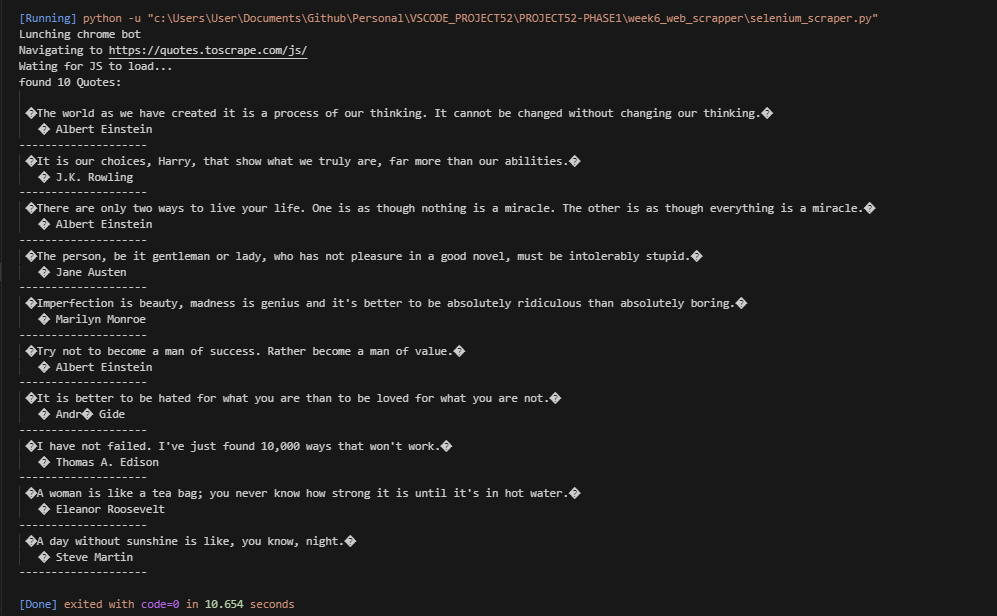

## 1. The Initiative
Day 4 focused on **scraping dynamic content**.
Standard libraries like `requests` cannot see data loaded via JavaScript (client-side rendering). To overcome this, we deployed **Selenium**, a browser automation tool that launches a real Chrome instance, executing the JavaScript just like a human user's browser would.

## 2. The Concepts

### Concept A: The WebDriver
Selenium requires a "Driver" to interface with the browser.
* **Command:** `webdriver.Chrome()` launches a controlled instance of Google Chrome.
* **Control:** We can programmatically direct this browser to URLs, click elements, and extract text.

### Concept B: The Wait Strategy
JavaScript takes time to fetch data.
* **The Problem:** If we scrape immediately after loading, the HTML is empty.
* **The Solution:** `time.sleep(3)` forces the script to pause, giving the browser time to render the DOM elements before we attempt to find them.

### Concept C: Element Selection (Selenium Syntax)
Selenium uses a different syntax than BeautifulSoup.
* **BeautifulSoup:** `soup.select("div.quote")`
* **Selenium:** `driver.find_elements(By.CLASS_NAME, "quote")`

## 3. The Code Specimen
*The script that launches a browser, waits for JS execution, and extracts data:*
```python
# 1. Launch Real Browser
driver = webdriver.Chrome()
driver.get("[https://quotes.toscrape.com/js/](https://quotes.toscrape.com/js/)")

# 2. Wait for JS to Load
time.sleep(3)

# 3. Extract Data
quotes = driver.find_elements(By.CLASS_NAME, "quote")
for quote in quotes:
    text = quote.find_element(By.CLASS_NAME, "text").text
    print(text)

# 4. Cleanup
driver.quit()
````

## 4. The Output
_The script successfully extracted quotes that do not exist in the raw HTML source code, proving the JavaScript was executed._

