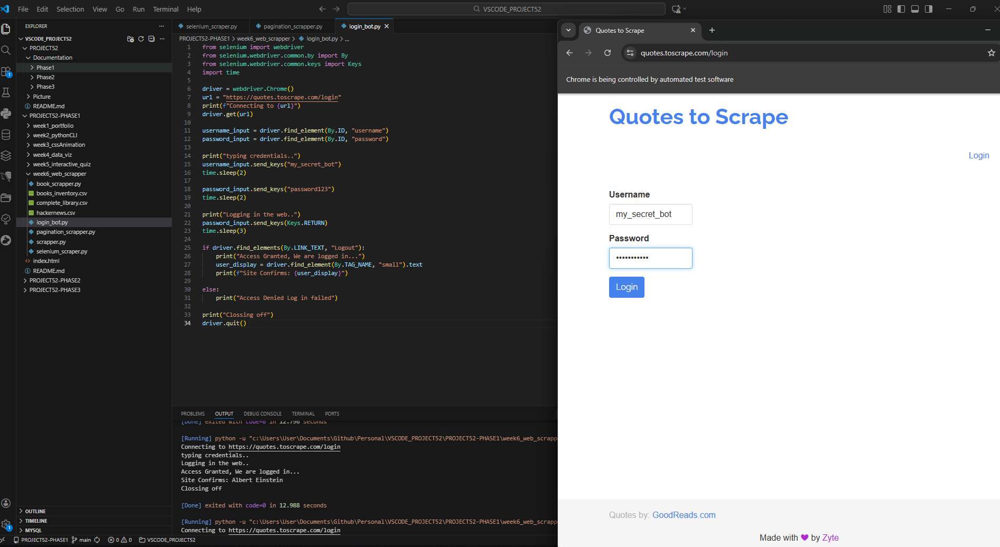
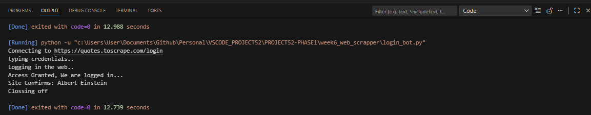

## 1. The Initiative
Day 5 focused on **Interaction and Authentication**.
Reading data is passive; typing data is active. Today, I programmed the bot to input credentials into a secure form to bypass an authentication wall, granting access to user-specific data that is otherwise hidden from public scrapers.

## 2. The Concepts

### Concept A: Input Interaction (`send_keys`)
We used `send_keys()` to simulate human typing.
* **Targeting:** Located the `<input>` fields by ID (`username`, `password`).
* **Action:** Sent string data to those fields.

### Concept B: Special Keys
Sometimes we need to press non-character keys (Enter, Tab, Escape).
* **Library:** `from selenium.webdriver.common.keys import Keys`
* **Usage:** `element.send_keys(Keys.RETURN)` simulates pressing the Enter key to submit a form without needing to find/click the specific submit button.

### Concept C: State Verification
A bot needs to know if it succeeded.
* **Logic:** After submitting, we check for an element that *only* exists when logged in (e.g., a "Logout" button). If found, the login was a success.

## 3. The Code Specimen
*The sequence to penetrate the login screen:*
```python
# 1. Target the boxes
username_input = driver.find_element(By.ID, "username")
password_input = driver.find_element(By.ID, "password")

# 2. Inject Credentials
username_input.send_keys("my_secret_bot")
password_input.send_keys("password123")

# 3. Breach (Hit Enter)
password_input.send_keys(Keys.RETURN)
````

## 4. The Output
_Terminal Confirmation:_
`✅ ACCESS GRANTED. We are logged in!`
`👤 Site confirms: Logged in as my_secret_bot`



