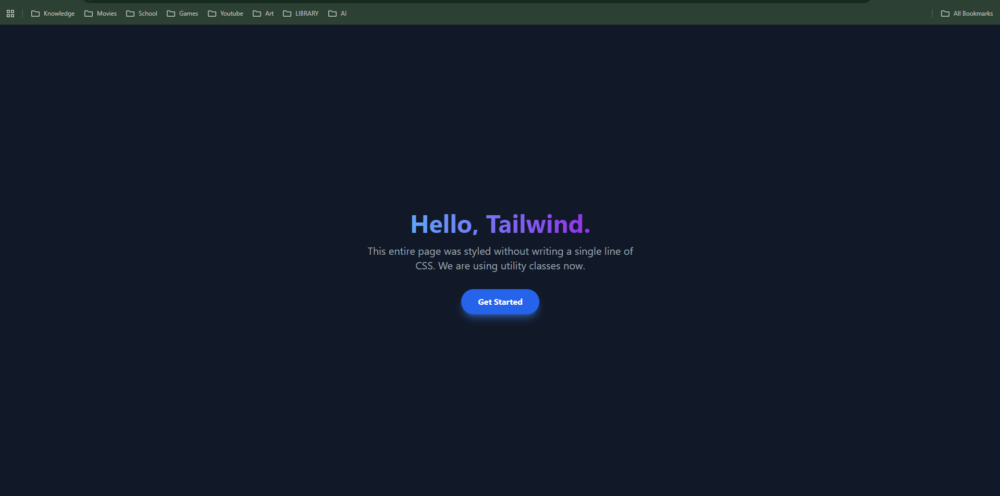

## 1. The Initiative
Day 1 focused on **Environment Setup**.
Instead of the traditional "CSS File" approach, I adopted the **Utility-First** methodology using Tailwind CSS. This allows for styling elements directly within the HTML markup, significantly speeding up the prototyping phase.

## 2. The Concepts

### Concept A: The CDN (Content Delivery Network)
For this project, I am loading Tailwind via a CDN link (`<script src="..."></script>`).
* **Pros:** Zero installation, works instantly in any HTML file.
* **Cons:** Heavier download size (not optimized for production), but perfect for development.

### Concept B: Utility Classes vs. Semantic Classes
* **Traditional:** `<div class="card">` (Requires writing CSS for .card)
* **Tailwind:** `<div class="bg-white p-6 rounded-lg shadow-lg">` (Styles applied immediately)

## 3. The Code Specimen
*The magic line that activates the framework:*
```html
<script src="[https://cdn.tailwindcss.com](https://cdn.tailwindcss.com)"></script>
````

## 4. The Output
A "Hello World" screen featuring modern UI patterns (gradients, colored shadows) rendered instantly without a stylesheet.

