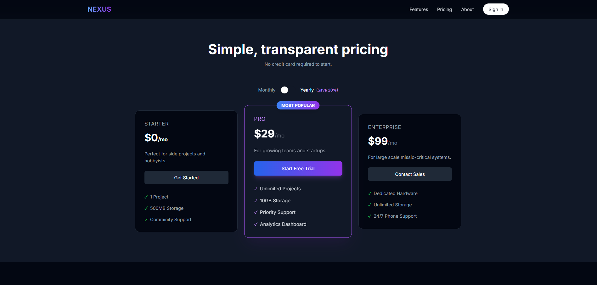
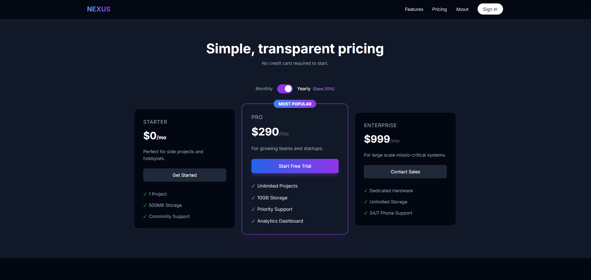

# 📝 DEV LOG: WEEK 07 - DAY 6

**Focus:** Breathing life into the static pricing table using JavaScript.

## 1. The Initiative
The pricing toggle ("Monthly" vs "Yearly") was purely visual. I needed to make it functional.
The goal was to listen for a user click, animate the switch, and instantly update the price numbers without a page reload.

## 2. The Concepts
### Concept A: DOM Selection
To control HTML elements, I had to assign them unique `id` attributes and select them in JavaScript:
```javascript
const toggleButton = document.getElementById('billing-toggle');
````

### Concept B: State Management
I created a variable to track the "truth" of the application:
`let isYearly = false;`
Every time the user clicks, I flip this switch (`isYearly = !isYearly`).

### Concept C: Class Toggling (Animation)
Instead of using complex animation libraries, I used Tailwind classes for the movement.

- **To move right:** `classList.add('translate-x-6')`    
- **To move left:** `classList.remove('translate-x-6')`

This triggers the CSS `transition` property, creating a smooth slide effect.

## 3. The Output
A fully interactive Pricing Component.

- **Input:** User clicks the toggle.   
- **Visual Feedback:** The knob slides, color changes to purple.
- **Data Update:** Prices update instantly (e.g., $29 $\to$ $290).






---

## 4. Standard Operating Procedures (Shut Down)
**To Shut Down:**

1. Stop the Tailwind Watcher (`Ctrl + C`).
2. Commit changes: `git commit -m "feat(js): add interactive pricing toggle logic"`
3. Close VS Code. 

---
**Total Project Time:** 1 Hour
**Status:** 🚀 INTERACTIVE

