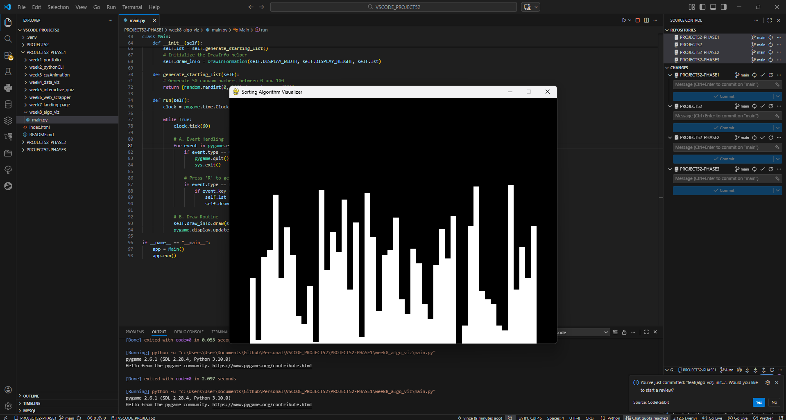
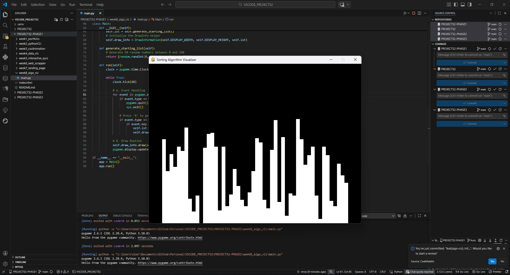

# 📝 DEV LOG: WEEK 08 - DAY 1
**Focus:** Building the Graphics Engine to visualize data.

## 1. The Initiative
Week 8 is about seeing how computers think. Before I can implement sorting algorithms, I need a "Canvas" that can represent numbers as visual objects.
The goal today was to build a Python/Pygame engine that generates random numbers and draws them as vertical bars.

## 2. The Concepts

### Concept A: Normalization (The Math)
The biggest challenge was making sure the bars always fit the screen, no matter how big the numbers are.
* **Width Math:** `(Screen Width - Padding) / Count` -> Ensures bars get thinner as we add more data.
* **Height Math:** `(Screen Height - Padding) / (Max Val - Min Val)` -> Ensures the tallest bar always touches the top, and the shortest touches the bottom.

### Concept B: Class-Based Architecture
I structured the app into two main classes:
1.  `DrawInformation`: Holds the "Config" (Colors, Fonts, Window Dimensions, List Data).
2.  `Main`: Holds the "State" (The Loop, Event Listeners, Reset Logic).

### Concept C: The Render Loop
Unlike web dev (which waits for events), Pygame runs a continuous loop (60 frames per second).
1.  **Input:** Check if 'R' or 'Quit' is pressed.
2.  **Update:** Regenerate list if needed.
3.  **Render:** Fill screen Black -> Draw Rectangles -> Update Display.

## 3. The Output
A window that displays 50 random integers as white bars. Pressing `R` instantly generates a new dataset.

---
**Total Time:** 1 Hour
**Next Steps:** Implementing the first algorithm (Bubble Sort).
