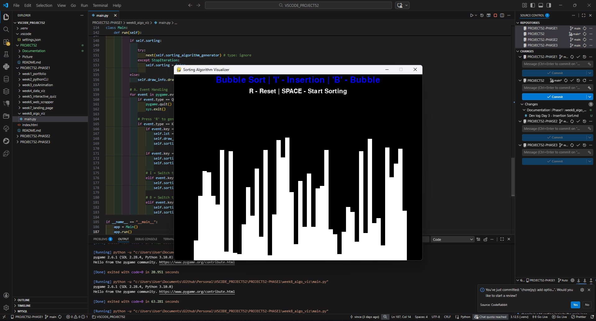
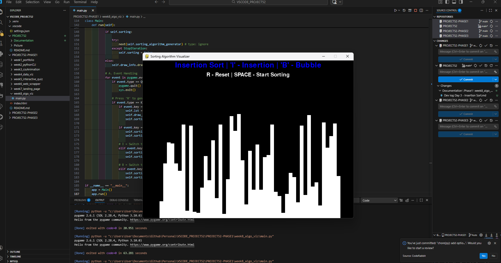
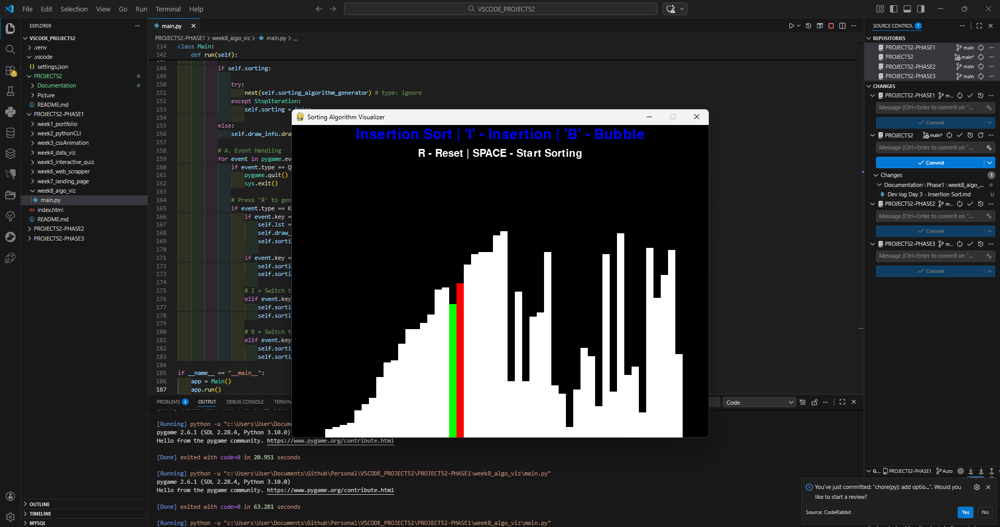
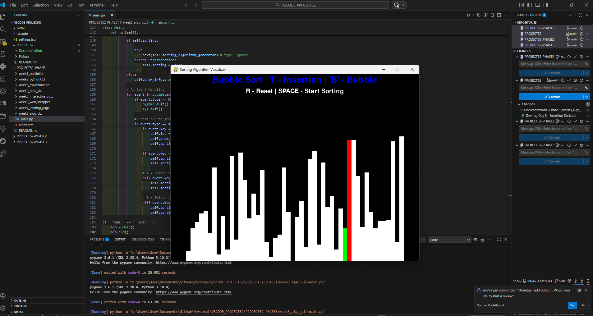

# 📝 DEV LOG: WEEK 08 - DAY 3

**Focus:** Adding a second algorithm (Insertion Sort) and building a Control Panel.

## 1. The Initiative
Bubble Sort was working, but the tool was hard to use. I didn't know which keys did what.
Today I added:
1.  **On-Screen Instructions (HUD):** Using `pygame.font`.
2.  **Insertion Sort:** A smarter algorithm that builds a sorted list one item at a time.
3.  **Switching Logic:** The ability to toggle algorithms dynamically.

## 2. The Concepts

### Concept A: Insertion Sort Logic
Unlike Bubble Sort (which swaps neighbors endlessly), Insertion Sort maintains a "Sorted Sublist" on the left side.
1.  Take the first unsorted element.
2.  Look backwards (`i - 1`).
3.  If the previous element is larger, swap. Repeat until it "slots" into the correct place.
4.  **Visual difference:** It looks like the bar is being "inserted" into the sorted pile.

### Concept B: Font Rendering in Pygame
Text isn't just "printed." It must be:
1.  **Created:** `font.render("Text", antialias, Color)` -> Creates an image surface.
2.  **Blitted:** `window.blit(surface, (x, y))` -> Draws that image onto the screen.

## 3. The Output
A fully interactive visualizer.
* **Controls:** `R` (Reset), `Space` (Start), `I` (Insertion), `B` (Bubble).
* **Feedback:** The top of the screen displays the current mode and instructions.










---

## 4. Source Code (Current Version)

```python
import pygame
import math
import random
import sys
from pygame.locals import * # type: ignore

# --- GLOBAL CONFIGURATION ---
BLACK = (0, 0, 0)
WHITE = (255, 255, 255)
GREEN = (0, 255, 0)
RED = (255, 0, 0)
GREY = (128, 128, 128)
BLUE = (0, 0, 255)  # New color for the HUD text

class DrawInformation:
    SIDE_PAD = 100
    TOP_PAD = 150

    def __init__(self, width, height, lst):
        self.width = width
        self.height = height
        
        self.window = pygame.display.get_surface()
        self.set_list(lst)
        
        # FONT SETUP
        self.font = pygame.font.SysFont('arial', 30)
        self.large_font = pygame.font.SysFont('arial', 40)

    def set_list(self, lst):
        self.lst = lst
        self.min_val = min(lst)
        self.max_val = max(lst)

        self.block_width = round((self.width - self.SIDE_PAD) / len(lst))
        self.block_height = math.floor((self.height - self.TOP_PAD) / (self.max_val - self.min_val))
        self.start_x = self.SIDE_PAD // 2

    def draw(self, bg_color, algo_name, color_positions={}):
        self.window.fill(bg_color)
        
        # 1. DRAW CONTROLS (THE HUD)
        controls = "R - Reset | SPACE - Start Sorting"
        sorting_text = f"{algo_name} | 'I' - Insertion | 'B' - Bubble"
        
        controls_surface = self.font.render(controls, 1, WHITE)
        sorting_surface = self.large_font.render(sorting_text, 1, BLUE)
        
        # Center the text
        self.window.blit(controls_surface, (self.width/2 - controls_surface.get_width()/2, 45))
        self.window.blit(sorting_surface, (self.width/2 - sorting_surface.get_width()/2, 5))

        # 2. DRAW BARS
        for i, val in enumerate(self.lst):
            x = self.start_x + i * self.block_width
            y = self.height - (val - self.min_val) * self.block_height
            
            color = WHITE
            if i in color_positions:
                color = color_positions[i]
            
            pygame.draw.rect(self.window, color, (x, y, self.block_width, self.height))
            
        pygame.display.update()

# --- ALGORITHMS ---

def bubble_sort(draw_info):
    lst = draw_info.lst
    for i in range(len(lst) - 1):
        for j in range(len(lst) - 1 - i):
            num1 = lst[j]
            num2 = lst[j + 1]

            if num1 > num2:
                lst[j], lst[j + 1] = lst[j + 1], lst[j]
                # Visualize Swap
                draw_info.draw(BLACK, "Bubble Sort", {j: GREEN, j+1: RED})
                yield True
    return lst

def insertion_sort(draw_info):
    lst = draw_info.lst
    
    # Start from the second element
    for i in range(1, len(lst)):
        current = lst[i]
        
        # Look backwards to find the right spot
        while True:
            # FIX: Correct logic is i > 0, NOT 1 > 0
            ascending_sort = i > 0 and lst[i - 1] > lst[i]
            
            if not ascending_sort:
                break
            
            # SWAP
            lst[i], lst[i - 1] = lst[i - 1], lst[i]
            
            # Visualize: Green is the sorted part, Red is the active mover
            draw_info.draw(BLACK, "Insertion Sort", {i - 1: GREEN, i: RED})
            yield True
            
            # Move index backwards
            i -= 1
            
    return lst

class Main:
    pygame.init()
    
    DISPLAY_WIDTH = 800
    DISPLAY_HEIGHT = 600
    DISPLAY = pygame.display.set_mode((DISPLAY_WIDTH, DISPLAY_HEIGHT))
    
    def __init__(self):
        pygame.display.set_caption("Sorting Algorithm Visualizer")
        self.lst = self.generate_starting_list()
        self.draw_info = DrawInformation(self.DISPLAY_WIDTH, self.DISPLAY_HEIGHT, self.lst)
        
        # State Variables
        self.sorting = False
        self.sorting_algorithm = bubble_sort
        self.sorting_algo_name = "Bubble Sort"
        self.sorting_algorithm_generator = None

    def generate_starting_list(self):
        return [random.randint(0, 100) for _ in range(50)]

    def run(self):
        clock = pygame.time.Clock()
        
        while True:
            clock.tick(60)
            
            # --- SORTING EXECUTION ---
            if self.sorting:
                try:
                    next(self.sorting_algorithm_generator)
                except StopIteration:
                    self.sorting = False
            else:
                # Draw static screen (pass the current algo name)
                self.draw_info.draw(BLACK, self.sorting_algo_name)

            # --- EVENT HANDLING ---
            for event in pygame.event.get():
                if event.type == QUIT:
                    pygame.quit()
                    sys.exit()
                
                if event.type == KEYDOWN:
                    # R = Reset
                    if event.key == K_r:
                        self.lst = self.generate_starting_list()
                        self.draw_info.set_list(self.lst)
                        self.sorting = False
                    
                    # SPACE = Start
                    elif event.key == K_SPACE and not self.sorting:
                        self.sorting = True
                        self.sorting_algorithm_generator = self.sorting_algorithm(self.draw_info)
                    
                    # I = Switch to Insertion Sort
                    elif event.key == K_i and not self.sorting:
                        self.sorting_algorithm = insertion_sort
                        self.sorting_algo_name = "Insertion Sort"
                    
                    # B = Switch to Bubble Sort
                    elif event.key == K_b and not self.sorting:
                        self.sorting_algorithm = bubble_sort
                        self.sorting_algo_name = "Bubble Sort"

if __name__ == "__main__":
    app = Main()
    app.run()
````
